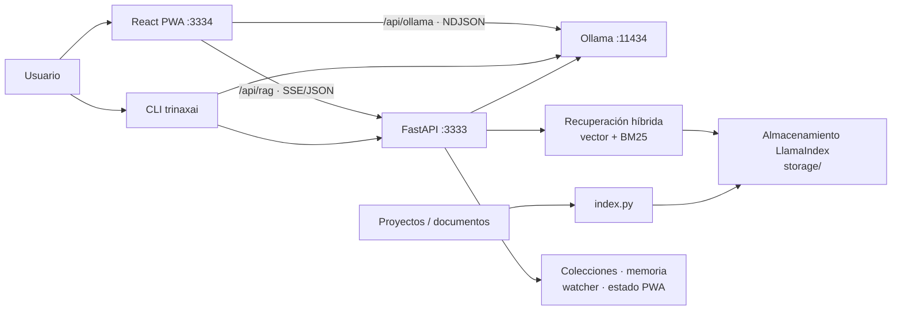

# 🚀 TrinaxAI — Asistente de IA 100% Local

<p align="center">
  
</p>

<p align="center">
  <strong>Asistente de IA open-source, local-first con RAG, visión, voz, CLI y PWA.</strong><br>
  Corre completamente en tu máquina. Sin nube. Sin suscripciones. Sin límites.
</p>

<p align="center">
  <a href="LICENSE"></a>
  <a href="#-inicio-rápido"></a>
  <a href="#-plataformas-soportadas"></a>
  <a href="chat-pwa/README.es.md"></a>
</p>

> **⭐ Si TrinaxAI te ayuda, ¡dale una estrella al repo! Ayuda a que otros lo encuentren.**

---

## 📋 Estado del Proyecto

TrinaxAI es **estable y mantenido activamente**. Las funciones principales (chat, RAG, PWA, CLI, voz, visión) están maduras. Foco actual: pruebas, endurecimiento de seguridad y documentación para contribuidores.

| Área | Estado |
|------|--------|
| Backend API (FastAPI) | ✅ Estable |
| RAG con búsqueda híbrida | ✅ Estable |
| PWA (React 19 + Vite 6) | ✅ Estable |
| CLI (`trinaxai`) | ✅ Estable |
| Instaladores multiplataforma | 🧪 Linux probado en CI; Windows/macOS con validación de sintaxis |
| Cobertura de pruebas | 🚧 Creciendo |
| Documentación de arquitectura | 📝 Mejorando |
| Soporte Docker | 📅 Planeado |

---

## ¿Qué es TrinaxAI?

TrinaxAI es un **asistente de IA local** que combina una interfaz de chat tipo ChatGPT (PWA) con una CLI para desarrolladores, búsqueda semántica de código (RAG), modo de voz y visión. Todo corre en tu máquina — tus datos nunca salen de tu red.

- **Chatea** con modelos Ollama desde una PWA o terminal CLI
- **Indexa tus proyectos** para búsqueda semántica de código con citas
- **Conversaciones por voz** con reconocimiento y síntesis de voz
- **Visión** — analiza imágenes y capturas de pantalla localmente
- **Multiplataforma** — Linux, macOS, Windows. Instalación en un comando.

---

## ✨ Características

- 🧠 **Dos motores de IA** — Ollama (rápido, creativo) + RAG (preciso, contextual)
- 📇 **RAG personalizado** — Indexa tu biblioteca de proyectos. La IA responde con contexto real
- 🗂️ **Colecciones de conocimiento** — Crea espacios RAG separados y consulta uno o varios
- 🧭 **Memoria local** — "recuerda que..." persiste entre dispositivos
- 🎤 **Modo llamada** — Reconocimiento de voz + texto a voz
- 📸 **Visión** — Analiza imágenes con qwen3-vl
- 💻 **CLI para desarrolladores** — `trinaxai ask`, `trinaxai chat`, `trinaxai index`, `trinaxai doctor`
- 🌐 **Bilingüe** — Español e inglés, auto-detectado
- 🌓 **Modo claro/oscuro** — Auto-detectado del sistema
- 📱 **PWA** — Instala como app nativa en iOS, Android y escritorio
- 📤 **Historial** — Busca chats, edita/reenvía, exporta a Markdown/PDF
- 🛡️ **100% Local** — Tus datos nunca salen de tu red

---

## 🧭 Vista General

TrinaxAI tiene dos rutas de chat: Ollama directo para conversación general/visión y FastAPI para recuperación sobre contenido indexado. La PWA llega a ambos mediante proxies same-origin de Vite.



Las consultas RAG recuperan candidatos vectoriales y BM25, pueden reordenarlos y piden a Ollama sintetizar una respuesta con citas. El chat directo omite el índice. `service_manager.py` supervisa servicios en Linux, macOS y Windows; no depende exclusivamente de systemd.

---

## 📸 Capturas de pantalla

Próximamente. Si quieres contribuir, captura las siguientes vistas en resolución 1440×900 (PNG, optimizado con `pngquant`):

| Captura | Ruta | Descripción |
|---|---|---|
| Chat | `docs/assets/screenshots/chat.png` | Interfaz principal de chat con citas RAG |
| Indexación | `docs/assets/screenshots/indexing.png` | Indexación de colecciones con barra de progreso |
| Configuración | `docs/assets/screenshots/settings.png` | Panel de configuración con modelos |
| PWA Móvil | `docs/assets/screenshots/mobile-pwa.png` | PWA instalada en pantalla de inicio móvil |

Ejecuta `./install.sh && trinaxai start`, abre `https://localhost:3334` y envía un PR con tus capturas.

---

## 🖥️ Plataformas Soportadas

| SO | Instalador | Gestor de Servicios | Estado de validación |
|---|---|---|---|
| **Linux** (Ubuntu, Debian, Fedora, Arch) | `install.sh` | systemd de usuario | Soportado y probado en CI en Ubuntu |
| **macOS** (Intel + Apple Silicon) | `install.sh` | launchctl | Instalador disponible; CI con validación de sintaxis Python/CLI/bash |
| **Windows** (10/11, PowerShell) | `install.ps1` | supervisor de subprocesos | Instalador disponible; CI con validación de sintaxis Python/CLI/PowerShell |

Guías completas: [Linux](docs/INSTALL_LINUX.md) · [macOS](docs/INSTALL_MACOS.md) · [Windows](docs/INSTALL_WINDOWS.md)
<br>Guías en español: [Linux](docs/INSTALL_LINUX.es.md) · [macOS](docs/INSTALL_MACOS.es.md) · [Windows](docs/INSTALL_WINDOWS.es.md)

---

## 🚀 Inicio Rápido

### Instalación en un comando (Linux / macOS)

```bash
curl -fsSL https://raw.githubusercontent.com/TrinaxCode/TrinaxAI/main/install.sh | bash
```

> **Nota de seguridad:** Revisa el script primero con `curl -fsSL URL | less` o clona el repo y ejecuta localmente.

### Windows

```powershell
git clone https://github.com/TrinaxCode/TrinaxAI.git
cd TrinaxAI
powershell -ExecutionPolicy Bypass -File .\install.ps1
```

### Instalación manual

```bash
git clone https://github.com/TrinaxCode/TrinaxAI.git
cd TrinaxAI
./install.sh

# O con más control:
./install.sh --interactive     # Preguntar antes de cada paso opcional
./install.sh --no-models       # No descargar modelos
./install.sh --profile ultra   # Forzar perfil (8gb, 16gb, max, ultra)
```

### Opciones del instalador

| Flag | Descripción |
|------|-------------|
| `--interactive` | Instalación guiada; pregunta antes de cada paso opcional (por defecto) |
| `--non-interactive` | Instalación automática para CI/scripts |
| `--no-models` | No descargar modelos de Ollama |
| `--no-vision` | No descargar modelo de visión |
| `--no-autostart` | No activar inicio automático |
| `--no-auto-update` | No activar la comprobación semanal segura en GitHub |
| `--no-start` | No iniciar TrinaxAI después de instalar |
| `--profile 8gb\|16gb\|max\|ultra` | Forzar perfil de hardware |
| `--lan-system` | Activar control de sistema desde LAN (genera token admin) |

Por defecto, el **control de sistema desde LAN está desactivado** — ningún dispositivo en tu red puede llamar endpoints sensibles. Actívalo explícitamente con `--lan-system` o configura `TRINAXAI_ALLOW_LAN_SYSTEM=1` y `TRINAXAI_ADMIN_TOKEN` en `.env`.

### Actualizar y desinstalar

```bash
./update.sh      # Actualizador guiado; pregunta backup, modelos, autostart, reinicio, auditoría
./uninstall.sh   # Desinstalador guiado; pregunta cada elemento removible
```

En Windows usa scripts nativos de PowerShell:

```powershell
powershell -ExecutionPolicy Bypass -File .\update.ps1
powershell -ExecutionPolicy Bypass -File .\uninstall.ps1
```

Las dependencias requeridas se instalan/actualizan automáticamente. Las opciones como descarga de modelos, inicio automático, eliminación de datos y reinicios se preguntan por defecto.

Las instalaciones nuevas activan automáticamente una comprobación semanal. Primero descarga el actualizador más reciente, sincroniza `origin/main`, renueva dependencias Python/npm, recompila la PWA y reinicia TrinaxAI. Conserva `.env`, configuración, índices, modelos, certificados y datos personales. El resultado queda en `logs/auto-update.log` y el desinstalador elimina también la tarea programada.

### Abrir la PWA

```
https://localhost:3334
```

Desde tu teléfono (misma WiFi): `https://[TU-IP-LOCAL]:3334`

---

## 💻 CLI

TrinaxAI incluye una CLI para desarrolladores con flujos de trabajo nativos de terminal.

```bash
# Instalar la CLI (desde la raíz del repo)
pip install -e .

# Comandos rápidos
trinaxai                  # REPL interactivo
trinaxai ask "..."        # Pregunta única
trinaxai chat             # Chat interactivo
trinaxai index .          # Indexar el directorio actual
trinaxai browse list-collections
trinaxai doctor           # Verificación de salud del sistema
trinaxai start            # Iniciar todos los servicios
trinaxai stop             # Detener IA; mantener disponible la PWA
trinaxai watch start --paths . --collection default
trinaxai research --query "..." --depth 2
trinaxai export           # Exportar una conversación
trinaxai memory list      # Gestionar memoria persistente
trinaxai collections list # Listar o gestionar colecciones RAG
trinaxai chat --engine rag
trinaxai chat --engine ollama
```

El motor predeterminado de la CLI es Ollama; selecciona `--engine rag` cuando necesites contexto indexado. Consulta la [referencia completa de CLI](docs/CLI_REFERENCE.es.md).

---

## 🏗️ Arquitectura

```
┌──────────────────────────────────────────┐
│              Tu Dispositivo              │
│  ┌──────────┐  ┌─────────────────────┐   │
│  │ PWA (React)│  │ CLI (trinaxai)     │   │
│  │ :3334     │  │ pip install -e .    │   │
│  └─────┬─────┘  └──────────┬──────────┘   │
│        │                   │               │
│  ┌─────┴───────────────────┴──────────┐   │
│  │     RAG API (FastAPI) :3333        │   │
│  │  LlamaIndex • bge-m3 • BM25       │   │
│  └─────┬──────────────────────────────┘   │
│        │                                   │
│  ┌─────┴──────┐                            │
│  │  Ollama    │  qwen3 • qwen2.5-coder    │
│  │  :11434    │  bge-m3 • qwen3-vl        │
│  └────────────┘                            │
└──────────────────────────────────────────┘
```

---

## 🔒 Modelo de Seguridad

TrinaxAI es **local-first por diseño**. Esto es lo que significa en la práctica:

| Capa | Por defecto | Cómo endurecer |
|------|-------------|----------------|
| **RAG API** | Escucha en `0.0.0.0:3333` para acceso PWA/teléfono | Usa `TRINAXAI_HOST=127.0.0.1` para solo localhost |
| **Endpoints de sistema** | Requieren localhost o token admin | Configura `TRINAXAI_ADMIN_TOKEN` y `TRINAXAI_ALLOW_LAN_SYSTEM=1` |
| **Ollama** | Escucha en `127.0.0.1` por defecto | Firewall en puerto 11434 si lo expones |
| **PWA** | Servida sobre HTTPS autofirmado | Usa nginx/Caddy con Let's Encrypt para certificados confiables |
| **Subida de archivos** | Sanitizados, en `local_sources/collections/` | Ajusta `TRINAXAI_UPLOAD_MAX_BYTES` |
| **CORS** | localhost + tu IP LAN por defecto | Personaliza con `TRINAXAI_CORS_ORIGINS` |

**El control de sistema desde LAN está desactivado por defecto.** Actívalo explícitamente durante la instalación (`--lan-system`) o configura `TRINAXAI_ALLOW_LAN_SYSTEM=1` en `.env`. Al activarlo, se genera automáticamente un `TRINAXAI_ADMIN_TOKEN` fuerte.

Ajustes de rendimiento para hardware local:

```bash
TRINAXAI_INDEX_BATCH_SIZE=100
TRINAXAI_RATE_LIMIT_PER_MINUTE=30
TRINAXAI_EMBED_WORKERS=2
TRINAXAI_EMBED_BATCH=8
TRINAXAI_EMBED_KEEP_ALIVE=15m
```

### Recomendaciones para acceso LAN / remoto

- Usa un **firewall** para restringir los puertos 3333, 3334, 11434 a dispositivos de confianza
- Usa una **VPN** (Tailscale, WireGuard) para acceso remoto — no expongas puertos a internet
- Configura `TRINAXAI_ADMIN_TOKEN` con un valor aleatorio fuerte
- Mantén la PWA en **localhost o WiFi privada** — no en redes públicas
- Audita tu instalación con `trinaxai doctor`

Consulta [SECURITY.md](SECURITY.md) para el modelo de amenazas completo y el proceso de reporte.

---

## 🧪 Desarrollo

```bash
git clone https://github.com/TrinaxCode/TrinaxAI.git
cd TrinaxAI

# Backend Python
python3 -m venv .venv
source .venv/bin/activate
pip install -r requirements.txt
python rag_api.py

# Frontend PWA
cd chat-pwa
npm install
npm run dev

# CLI (instalación editable)
pip install -e .
trinaxai doctor
```

Guía completa: [docs/DEVELOPER_GUIDE.es.md](docs/DEVELOPER_GUIDE.es.md).

## 📚 Documentación

Usa el [índice de documentación](docs/README.es.md) para navegar todo el conjunto. Referencias clave: [arquitectura](docs/ARCHITECTURE.es.md), [configuración](docs/CONFIGURATION.es.md), [CLI](docs/CLI_REFERENCE.es.md), [API HTTP](docs/API_REFERENCE.es.md) y [PWA](chat-pwa/README.es.md).

---

## ✅ Pruebas y Auditoría

```bash
# Auditoría pre-release (verifica i18n, hardcodes, archivos requeridos, .gitignore)
python3 scripts/public_readiness.py

# Verificaciones Python
python3 -m py_compile rag_api.py config.py index.py trinaxai_cli.py
ruff check .

# Verificaciones PWA
cd chat-pwa
npx tsc --noEmit
npm run build
npm audit --audit-level=high

# Prueba de humo del sistema (requiere servicios corriendo)
trinaxai doctor
python3 test_system.py --verbose
```

---

## 📁 Estructura del Proyecto

| Ruta | Propósito |
|------|-----------|
| `rag_api.py` | Backend FastAPI — chat, health, control del sistema |
| `index.py` | Indexador de proyectos — chunking AST, modo incremental |
| `config.py` | Configuración central — modelos, perfiles, chunking |
| `trinaxai_cli/` | Paquete CLI modular (`trinaxai ask`, `trinaxai chat`, …) |
| `trinaxai_cli.py` | CLI standalone legacy (obsoleto, mantenido por compatibilidad) |
| `query.py` | Wrapper compatible para `trinaxai_cli.py` |
| `service_manager.py` | Supervisor cross-platform start/stop/status/watch |
| `startup_ai.sh` | Iniciar todos los servicios |
| `shutdown_ai.sh` | Apagado controlado |
| `backup.sh` / `update.sh` / `uninstall.sh` | Scripts de mantenimiento Linux/macOS |
| `update.ps1` / `uninstall.ps1` | Scripts de mantenimiento Windows |
| `install.sh` / `install.ps1` | Instaladores en un comando |
| `chat-pwa/` | Frontend React PWA ([README](chat-pwa/README.es.md)) |
| `scripts/public_readiness.py` | Auditoría pre-release |
| `test_system.py` | Verificación de salud del sistema |

---

## 📚 FAQ (Preguntas Frecuentes)

**P: ¿TrinaxAI envía mis datos a la nube?**  
R: No. Todo corre localmente. Las únicas llamadas de red son a Ollama (localhost:11434), la API RAG (localhost:3333) y Google Fonts (en la PWA). Ningún chat, código o documento sale de tu máquina.

**P: ¿Qué modelos se recomiendan?**  
R: El instalador auto-detecta la RAM. 8 GB usa `qwen3:4b-instruct-2507-q4_K_M`, `llama3.2:1b` (rápido), `qwen2.5-coder:1.5b` y `bge-m3`. 16 GB usa `qwen3:4b-instruct-2507-q4_K_M`, `qwen2.5-coder:3b` y `bge-m3`. Visita [canirun.ai](https://www.canirun.ai) para ver qué soporta tu hardware.

**P: ¿Puedo usarlo desde mi teléfono?**  
R: Sí. Abre `https://[TU-IP-LOCAL]:3334` desde cualquier dispositivo en la misma WiFi. La PWA es instalable en iOS y Android.

**P: ¿Qué tan seguro es el acceso LAN?**  
R: Los endpoints de sistema están protegidos — desactivados por defecto. Actívalos con `--lan-system` durante la instalación. Consulta [SECURITY.md](SECURITY.md).

**P: ¿Funciona sin GPU?**  
R: Sí. Ollama corre en CPU. El rendimiento depende de la RAM y el tamaño del modelo. El perfil `8gb` usa modelos pequeños optimizados para CPU.

**P: ¿Puedo indexar toda mi carpeta de Documentos?**  
R: Sí. El indexador soporta 15+ lenguajes con chunking AST. Es incremental — solo re-indexa archivos modificados.

**P: ¿Qué licencia tiene?**  
R: AGPL-3.0-or-later. Libre para uso personal y comercial. Ver [LICENSE](LICENSE) y [TRADEMARK.md](TRADEMARK.md).

---

## 🗺️ Hoja de Ruta

Ver [ROADMAP.md](ROADMAP.md) para el plan completo. Destacados:

- ✅ **Hecho** — Chat, RAG, voz, visión, PWA, CLI, instaladores, watcher, modo research
- 🔜 **Próximo** — Árbol jerárquico de conocimiento, resumen de conversaciones y mejor telemetría de indexación
- 📅 **Planeado** — Docker/Compose, servidor MCP, integración Obsidian, suite de benchmarks

---

## 🤝 Contribuir

¡PRs bienvenidas! Consulta [CONTRIBUTING.md](CONTRIBUTING.md) para guías e instrucciones de configuración.

- 🐛 Reporta bugs · 💡 Sugiere funcionalidades · 📝 Mejora la documentación · 🌍 Traduce · 🔧 Envía PRs

---

## 📄 Licencia

AGPL-3.0-or-later — ver [LICENSE](LICENSE). Consulta [TRADEMARK.md](TRADEMARK.md) para uso del nombre/logo.

---

<p align="center">
  <strong>Hecho por <a href="https://github.com/TrinaxCode">TrinaxCode</a></strong><br>
  <sub>La IA debe ser libre, privada y local.</sub>
</p>
