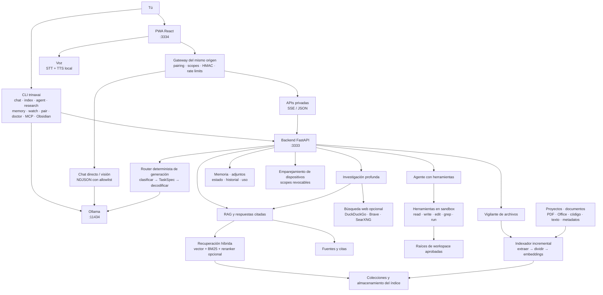

# 🚀 TrinaxAI — Asistente de IA Local-First

<p align="center">
  
</p>

<p align="center">
  <strong>Asistente de IA open-source y local con RAG, un agente programador con herramientas, visión, voz, una CLI y una PWA instalable.</strong><br>
  La inferencia y tus datos se quedan en tu equipo por defecto. Sin cuenta en la nube, sin suscripción.
</p>

<p align="center">
  <a href="LICENSE"></a>
  <a href="CHANGELOG.es.md"></a>
  <a href="#-inicio-rápido"></a>
  <a href="#️-plataformas-compatibles"></a>
  <a href="chat-pwa/README.es.md"></a>
  <a href="README.md"></a>
</p>

> **⭐ Si TrinaxAI te sirve, dale una estrella al repo — ayuda a que otros lo encuentren.**

[**English →**](README.md)

---

## 🚀 Inicio rápido

**Instala con un comando y abre la app.** TrinaxAI instala las dependencias de Python/Node, Ollama, descarga un conjunto de modelos acorde a tu RAM e inicia los servicios.

### Linux / macOS

```bash
git clone https://github.com/TrinaxCode/TrinaxAI.git
cd TrinaxAI
./install.sh
```

O en una línea (revisa el script antes — mira la nota de seguridad):

```bash
curl -fsSL https://raw.githubusercontent.com/TrinaxCode/TrinaxAI/main/install.sh | bash
```

### Windows (PowerShell)

```powershell
git clone https://github.com/TrinaxCode/TrinaxAI.git
cd TrinaxAI
powershell -ExecutionPolicy Bypass -File .\install.ps1
```

El instalador de Windows descarga las dependencias automáticamente; Ollama se instala vía `winget` (con el instalador silencioso oficial como respaldo).

### Abre la app

Cuando termine el instalador, abre la PWA:

```
https://localhost:3334
```

Listo. La primera vez verás un asistente de configuración (idioma, tema, modelo). La app se comunica con una API RAG local en `:3333` y con Ollama local en `:11434` — todo en tu equipo.

> **Nota de seguridad:** antes de pasar cualquier script a `bash`, revísalo: `curl -fsSL URL | less`, o clona y ejecútalo localmente.

### Opciones de instalación

```bash
./install.sh --non-interactive        # Instalación desatendida (CI/scripts)
./install.sh --no-models              # Omite la descarga de modelos
./install.sh --profile 16gb           # Fuerza un perfil de hardware
```

| Flag | Descripción |
|------|-------------|
| `--interactive` | Instalación guiada; pregunta las opciones (por defecto) |
| `--non-interactive` | Instalación desatendida para CI/scripts |
| `--no-models` | Omite la descarga de modelos de Ollama |
| `--no-vision` | Flag de compatibilidad; visión se descarga al analizar la primera imagen |
| `--no-autostart` | No habilita el arranque automático |
| `--no-auto-update` | No habilita la verificación semanal de versiones |
| `--no-start` | No inicia TrinaxAI tras instalar |
| `--profile 8gb\|16gb\|max\|ultra` | Sobrescribe el perfil de hardware detectado |
| `--lan-system` | Habilita el modo heredado de control por LAN (genera un token de admin) |

El instalador detecta tu RAM y elige un **perfil de hardware** (`8gb`, `16gb`, `max`, `ultra`) que decide qué modelos de Ollama se descargan. Mira [Modelos y perfiles](#-modelos-y-perfiles).

Guías completas: [Linux](docs/INSTALL_LINUX.es.md) · [macOS](docs/INSTALL_MACOS.es.md) · [Windows](docs/INSTALL_WINDOWS.es.md)
<br>English guides: [Linux](docs/INSTALL_LINUX.md) · [macOS](docs/INSTALL_MACOS.md) · [Windows](docs/INSTALL_WINDOWS.md)

### Actualizar y desinstalar

```bash
./update.sh      # Actualización guiada; conserva tus datos, pregunta por backup/modelos/reinicio
./uninstall.sh   # Desinstalación guiada; pregunta antes de borrar cada cosa
```

```powershell
powershell -ExecutionPolicy Bypass -File .\update.ps1
powershell -ExecutionPolicy Bypass -File .\uninstall.ps1
```

Las actualizaciones conservan tus datos locales. La tarea semanal opcional es **solo de verificación**: compara tu revisión instalada con GitHub y escribe la disponibilidad en `logs/auto-update.log` — nunca descarga ni ejecuta nada de forma desatendida. Tú ejecutas el actualizador guiado después de revisar la versión.

### Conecta otro dispositivo desde la PWA

Cualquier teléfono, tablet o computadora de la misma red privada puede abrir
`https://IP-LOCAL-DEL-HOST:3334`. La propia PWA guía la conexión segura:

1. En la computadora host, abre **TrinaxAI → Configuración → Dispositivo
   emparejado** y pulsa **Generar código de emparejamiento**.
2. En el otro dispositivo, abre la PWA con la IP local del host, elige **Ya tengo
   TrinaxAI en otro dispositivo** e introduce el código de un solo uso.
3. Ponle nombre al dispositivo y confirma. Después puedes instalar la PWA desde
   **Añadir a pantalla de inicio / Instalar aplicación** del navegador.
4. Desde el host puedes revisar o revocar dispositivos en **Configuración →
   Dispositivo emparejado**.

Cada dispositivo debe confiar en el certificado HTTPS local. Un equipo LAN
puede acceder al chat básico antes de emparejarse, pero RAG, historial
sincronizado, memoria, archivos, indexación, agente y control del sistema exigen
permisos explícitos. La PWA host genera un código de interfaz completa con
`chat,read_private,index,system,agent`; usa `trinaxai pair start --scopes ...`
para un equipo con privilegio mínimo (la CLI usa `chat,read_private` por
defecto). El host puede revocar el acceso de inmediato. Consulta la
[guía completa de la PWA](chat-pwa/README.es.md#emparejar-un-navegador).

---

## ¿Qué es TrinaxAI?

TrinaxAI es un **asistente de IA local-first** que corre por completo en tu propio hardware. Incluye:

- una **PWA conversacional instalable** en escritorio, teléfono y tablet,
- una **CLI para desarrolladores** (`trinaxai`) con un agente programador local y privado,
- un **motor RAG** que indexa tus proyectos y responde con contexto citado de tu código/documentos,
- **voz** (voz-a-texto + texto-a-voz) y **visión** (análisis de imágenes) con modelos locales.

La inferencia y los datos persistidos se quedan en el host configurado por defecto. Solo acciones explícitas usan la red: instalación, descarga de modelos, búsqueda web opcional o un endpoint de Ollama/búsqueda remoto puesto a propósito.

Cada dispositivo usa capacidades explícitas. La computadora host autoriza los
equipos emparejados y decide si sólo pueden chatear/leer datos privados o también
indexar, ejecutar el agente o controlar servicios. Además se respetan los
permisos del sistema operativo: TrinaxAI no puede acceder a carpetas, micrófono,
cámara o shell que el usuario o navegador no haya autorizado.

---

## ✨ Funciones

- 🧠 **Motores duales** — chat directo con Ollama (rápido, creativo) y RAG (respuestas fundamentadas y citadas sobre tus archivos).
- 🎯 **Pipeline de generación inteligente** — un clasificador determinista (sin LLM) lee cada turno y elige el modelo, los parámetros de decodificación y el estilo de prompt adecuados (código, razonamiento/matemáticas, creativo, RAG citado o explicación). Rápido y predecible, sin llamada extra al modelo.
- 🤖 **Agente con herramientas** — `trinaxai agent` y la vista de Agente usan herramientas en sandbox (`read/write/edit/list/glob/grep/run_command`), se limitan a un workspace y piden confirmación para acciones peligrosas.
- 📇 **RAG propio** — indexa tus proyectos; chunking con AST para 15+ lenguajes, recuperación híbrida vector + BM25, reranker opcional, citas a `rel_path`.
- 🔎 **Investigación profunda** — descomposición RAG multipaso (`trinaxai research` o el disparador en la app).
- 🌍 **Búsqueda web opcional** — activa el modo Internet para resultados actuales mediante DuckDuckGo, Brave Search o SearXNG; muestra fuentes y limita la lectura de páginas públicas.
- 🗂️ **Colecciones de conocimiento** — espacios RAG separados; consulta uno o varios.
- 🔊 **Sonidos de interfaz opcionales** — un interruptor persistente controla señales centralizadas sin superposición; desactivado no inicializa audio de efectos.
- 👀 **Vigilante de archivos** — reindexa carpetas automáticamente al cambiar.
- 🧭 **Memoria local** — hechos "recuerda que…" persisten localmente y se sincronizan entre tus dispositivos.
- 🎤 **Modo voz** — STT + TTS local, incluida una vista de llamada de voz manos libres en la PWA.
- 📸 **Visión** — analiza imágenes y capturas con un modelo de visión local.
- 💻 **CLI para desarrolladores** — `ask`, `chat`, `index`, `agent`, `research`, `doctor` y más.
- 🔗 **Sincronización entre dispositivos** — ajustes, historial y memoria se sincronizan entre dispositivos emparejados vía el backend local (sin nube).
- 🌐 **Bilingüe** — español e inglés, autodetectado; responde en el idioma en que escribes.
- 📱 **PWA instalable** — iOS, Android, escritorio; shell offline; tema claro/oscuro.
- 📎 **Documentos y adjuntos** — sube imágenes y documentos, extrae texto acotado para el turno actual y conserva referencias de adjuntos en el host para dispositivos emparejados.
- 🔄 **Sincronización de estado y uso** — sincronización versionada de ajustes/historial con revisiones seguras ante conflictos, borrados explícitos y estadísticas locales.
- 🛡️ **Seguridad local-first** — servicios en loopback, emparejamiento por scopes, gateway firmado con HMAC, agente en sandbox.

**Versión del proyecto:** 1.0.0 · **Licencia:** [AGPL-3.0-or-later](LICENSE)

---

## 🧭 Cómo funciona

TrinaxAI es una pila local con un gateway de PWA expuesto a la LAN, un backend FastAPI y Ollama. Cada solicitud pasa por el gateway con capacidades; las operaciones privadas requieren un dispositivo emparejado con el scope correspondiente y Ollama solo se expone mediante una fachada con allowlist.



Un turno normal se clasifica localmente y se envía al mejor modelo configurado. Un turno RAG busca en las colecciones seleccionadas, opcionalmente reordena los candidatos y pide a Ollama sintetizar una respuesta **citada**. La investigación combina varias pasadas de recuperación local con fuentes web opcionales; el agente opera solo dentro de las raíces de workspace aprobadas. El watcher mantiene los índices al día, mientras que memoria, adjuntos, historial, ajustes, pairing y uso permanecen en el host y solo se sincronizan con dispositivos autorizados. `service_manager.py` supervisa los servicios en Linux, macOS y Windows (systemd / launchctl / subproceso).

El modelo general predeterminado del perfil `16gb` es `qwen3.5:4b`, elegido por
mejor calidad conversacional en español; `qwen3.5:2b` queda para saludos y consultas triviales.
el autorouter determinista usa los modelos de código, profundidad o rapidez
cuando la tarea lo exige. Las subidas grandes se convierten en trabajos
persistentes con progreso real de etapa/páginas/chunks/lotes, timeouts,
cancelación, reconexión y reintento seguro. Los errores de proveedor, índice,
stream o primer token de Search/RAG salen de espera y permiten recuperarse.
Consulta [Configuración](docs/CONFIGURATION.es.md).

Mira [docs/ARCHITECTURE.es.md](docs/ARCHITECTURE.es.md) para el diseño completo y el flujo de datos.

---

## 🖥️ Plataformas compatibles

| SO | Instalador | Gestor de servicios | Estado |
|---|---|---|---|
| **Linux** (Ubuntu, Debian, Fedora, Arch) | `install.sh` | systemd de usuario | Lista para instalar y usar |
| **macOS** (Intel + Apple Silicon) | `install.sh` | launchctl | Lista para instalar y usar |
| **Windows** (10/11, PowerShell) | `install.ps1` | supervisor por subproceso | Lista para instalar y usar |

Funciona en CPU — no requiere GPU. El rendimiento escala con la RAM y el tamaño del modelo.

---

## 💻 CLI

```bash
pip install -e .          # instala la CLI desde la raíz del repo

trinaxai                  # REPL interactivo (auto-enruta chat · web · research · agent · RAG)
trinaxai ask "..."        # pregunta única
trinaxai chat             # sesión de chat interactiva
trinaxai chat --engine rag   # fuerza respuestas RAG fundamentadas
trinaxai index .          # indexa el directorio actual
trinaxai agent --workspace . # agente programador local con herramientas
trinaxai research --query "..." --depth 2
trinaxai browse list-collections
trinaxai collections list
trinaxai memory list
trinaxai watch start --paths . --collection default
trinaxai pair start       # empareja un navegador LAN con los mínimos scopes
trinaxai doctor           # chequeo de salud del sistema
trinaxai doctor --strict --json   # gate determinista para automatización
trinaxai start | stop | status    # ciclo de vida de servicios
trinaxai export           # exporta una conversación a Markdown
```

También existen los comandos superiores `browse`, `collections`, `memory`,
`watch`, `pair`, `obsidian`, `models`, `config`, `restart`, `update`, `uninstall`,
`version` y `help`. El motor predeterminado es Ollama; usa `--engine rag` cuando
necesites contexto indexado.

Dentro de `trinaxai` o `trinaxai chat`, escribe `/` para mostrar el menú. Los
comandos slash disponibles son `/help`, `/exit` (`/quit`), `/clear`, `/chat`
(`/general`, `/ollama`), `/agent`, `/web`, `/research`, `/rag`, `/auto`, `/model`,
`/workspace`, `/yolo`, `/index`, `/memory`, `/collections`, `/watch` y `/status`.
Sintaxis completa, subcomandos y TOML: [docs/CLI_REFERENCE.es.md](docs/CLI_REFERENCE.es.md).

---

## 🧠 Modelos y perfiles

El instalador elige un **perfil de hardware** según tu RAM. Los perfiles soportados son `8gb`, `16gb`, `max` y `ultra`; todo se puede sobrescribir en `.env`.

| Rol | Low (`8gb`) | Medium (`16gb`) | High (`max`) | Ultra |
|---|---|---|---|---|
| **Chat / razonamiento** | `qwen3.5:2b` | `qwen3.5:4b` | `qwen3.5:9b` | `qwen3.5:35b` (MoE) |
| **Código** | `qwen3.5:2b` | `qwen3.5:4b` | `qwen3.5:9b` | `qwen3-coder:30b` (MoE) |
| **Profundo** | `qwen3.5:2b` | `qwen3.5:4b` | `qwen3.5:9b` | `qwen3.5:35b` (MoE) |
| **Visión** | `qwen3.5:2b` | `qwen3.5:4b` | `qwen3.5:9b` | `qwen3.5:35b` (MoE) |
| **Rápido** | `qwen3.5:2b` | `qwen3.5:2b` | `qwen3.5:2b` | `qwen3.5:4b` |
| **Embeddings** | `qwen3-embedding:0.6b` (1024d) | `qwen3-embedding:0.6b` | `qwen3-embedding:0.6b` | `qwen3-embedding:0.6b` |

El **pipeline de generación** dirige cada solicitud entre los modelos general, profundo, de código y rápido del perfil; para visión usa el Qwen3-VL Instruct correspondiente. Los modelos de visión se descargan al analizar la primera imagen, así la instalación y los updates no se bloquean por un pull grande. Confirma los nombres con `ollama list` y ajusta `.env` si cambias de modelo. Mira [docs/CONFIGURATION.es.md](docs/CONFIGURATION.es.md) y [docs/ENVIRONMENT_VARIABLES.md](docs/ENVIRONMENT_VARIABLES.md).

---

## 🔒 Modelo de seguridad

TrinaxAI es **local-first por diseño.**

| Capa | Por defecto | Cómo endurecer |
|-------|---------|---------------|
| **API RAG** | Solo loopback, tras el gateway del mismo host | Mantén `TRINAXAI_HOST=127.0.0.1`; expón la PWA solo en LAN/VPN de confianza |
| **Identidad del gateway** | Identidad de cliente firmada con un secreto HMAC de instalación | Mantén `storage/.proxy_secret` en modo `0600` |
| **Emparejamiento** | Un código de un uso otorga `chat,read_private` | Otorga `index`/`system`/`agent` solo cuando haga falta; revoca dispositivos perdidos |
| **Admin/datos privados** | Loopback directo, scope de dispositivo o token de admin | Mantén `TRINAXAI_ADMIN_TOKEN` en el host; no lo pegues en navegadores |
| **Ollama** | Solo loopback; el gateway expone una allowlist estrecha | Nunca publiques el puerto 11434 ni un proxy genérico |
| **PWA** | HTTPS con certificado local generado | Confía el certificado por dispositivo, o usa nginx/Caddy + Let's Encrypt |
| **Agente** | Herramientas de archivo confinadas a las raíces registradas; la shell en Linux usa bubblewrap sin red | Mantén el yolo HTTP desactivado; nunca habilites el escape sin sandbox de forma remota |
| **CORS** | localhost + tu IP LAN | Personaliza con `TRINAXAI_CORS_ORIGINS` |

Para acceso LAN/remoto: usa un firewall para bloquear los puertos 3333/11434, una VPN (Tailscale/WireGuard) en vez de exponer puertos, y `trinaxai pair start` con los mínimos scopes. Modelo de amenazas completo y reporte: [política de seguridad](docs/es/SECURITY.md).

---

## 🧪 Desarrollo

```bash
git clone https://github.com/TrinaxCode/TrinaxAI.git
cd TrinaxAI

# Backend
python3 -m venv .venv && source .venv/bin/activate
pip install -r requirements.txt
python rag_api.py                     # sirve app.main:app en :3333

# PWA
cd chat-pwa && npm install && npm run dev   # :3334

# CLI (editable)
pip install -e . && trinaxai doctor
```

Las tareas comunes están en el `Makefile` (`make dev`, `make build`, `make lint`, `make test`, `make check`). Guía completa: [docs/DEVELOPER_GUIDE.es.md](docs/DEVELOPER_GUIDE.es.md).

---

## 📚 Documentación

Empieza en el [hub de documentación](docs/README.es.md). Referencias clave:

| Tema | Documento |
|---|---|
| Arquitectura y flujo de datos | [docs/ARCHITECTURE.es.md](docs/ARCHITECTURE.es.md) |
| Configuración | [docs/CONFIGURATION.es.md](docs/CONFIGURATION.es.md) |
| Variables de entorno | [docs/ENVIRONMENT_VARIABLES.md](docs/ENVIRONMENT_VARIABLES.md) |
| Referencia de la CLI | [docs/CLI_REFERENCE.es.md](docs/CLI_REFERENCE.es.md) |
| API HTTP | [docs/API_REFERENCE.es.md](docs/API_REFERENCE.es.md) |
| Guía del desarrollador | [docs/DEVELOPER_GUIDE.es.md](docs/DEVELOPER_GUIDE.es.md) |
| Frontend PWA | [chat-pwa/README.es.md](chat-pwa/README.es.md) |
| Instalación (Linux/macOS/Windows) | [Linux](docs/INSTALL_LINUX.es.md) · [macOS](docs/INSTALL_MACOS.es.md) · [Windows](docs/INSTALL_WINDOWS.es.md) |

La PWA también trae **documentación integrada** (abre **Docs** desde la barra lateral) que cubre instalación, configuración, modelos, indexación, seguridad, la API y la guía de conexión desde el teléfono.

---

## 📁 Estructura del proyecto

| Ruta | Propósito |
|------|---------|
| `app/main.py` | Fábrica de la app FastAPI y middleware |
| `app/routes/` · `app/services/` | Routers de dominio y servicios de backend |
| `app/generation/` | Pipeline de generación inteligente (clasificador, scoring, presets, prompts, validate) |
| `rag_api.py` | Punto de entrada compatible (re-exporta `app.main:app`) |
| `index.py` | Indexador de proyectos — chunking AST, modo incremental |
| `config.py` | Config central — modelos, perfiles, chunking, recuperación |
| `trinaxai_cli/` | Paquete modular de la CLI |
| `trinaxai_cli/agent/` | Agente con herramientas en sandbox (engine + tools) |
| `service_manager.py` | Supervisor multiplataforma start/stop/status/watch |
| `install.sh` · `install.ps1` | Instaladores de un comando |
| `update.sh` · `uninstall.sh` · `backup.sh` | Scripts de mantenimiento (`.ps1` en Windows) |
| `chat-pwa/` | Frontend PWA en React ([README](chat-pwa/README.es.md)) |
| `docs/` | Conjunto de documentación |

---

## 📚 Preguntas frecuentes

**¿TrinaxAI envía mis datos a la nube?**
No por defecto. La inferencia usa la instancia de Ollama en loopback y los datos RAG se quedan en el host. Solo la instalación, la descarga de modelos y la búsqueda web opcional contactan la red. Si apuntas a propósito Ollama/búsqueda a otro host, esas peticiones siguen tu configuración.

**¿Necesito GPU?**
No. Ollama corre en CPU. El perfil `8gb` usa modelos pequeños optimizados para CPU.

**¿Puedo usarlo desde otro dispositivo?**
Sí. Genera un código de un solo uso desde la configuración de la PWA host,
abre `https://IP-LOCAL-DEL-HOST:3334` en el otro dispositivo e introdúcelo.
Compartir WiFi no concede datos privados ni funciones privilegiadas.

**¿Puedo indexar toda mi carpeta de Documentos?**
Sí. Además de código, el indexador extrae texto de PDF/Office, Markdown/texto/datos, HTML, EPUB, correo, subtítulos, calendarios, contactos y notebooks. La reindexación es incremental; los binarios/media se omiten.

**¿Qué licencia?**
AGPL-3.0-or-later — libre para uso personal y comercial. Mira [LICENSE](LICENSE) y la [política de marca](docs/es/TRADEMARK.md).

---

---

## 🤝 Contribuir

¡PRs bienvenidos! — mira [cómo contribuir](docs/es/CONTRIBUTING.md). Reporta bugs · sugiere funciones · mejora la docs · traduce · envía PRs.

---

## 📄 Licencia

AGPL-3.0-or-later — mira [LICENSE](LICENSE). Uso de nombre/logo: [política de marca](docs/es/TRADEMARK.md).

---

<p align="center">
  <strong>Hecho por <a href="https://github.com/TrinaxCode">TrinaxCode</a></strong><br>
  <sub>La IA debería ser libre, privada y local.</sub>
</p>
