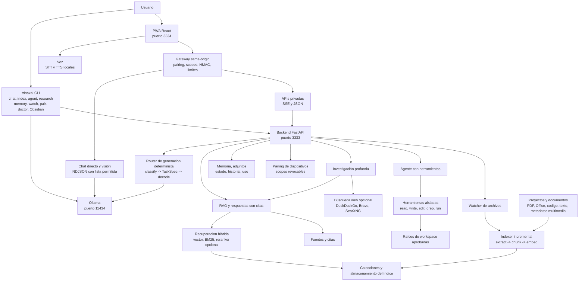

# TrinaxAI

<p align="center">
  
</p>

> Un asistente de IA local-first con un motor RAG de producción, un agente de código aislado y pairing de dispositivos con capacidades limitadas.
>
> Obtén respuestas con citas sobre tu propio código y tus documentos. La inferencia y los datos persistentes permanecen en tu equipo por defecto. Sin cuenta en la nube. Sin suscripción.

[Sitio web](https://www.trinaxai.app/) | [Documentación](docs/README.es.md) | [Changelog](docs/CHANGELOG.es.md) | [Licencia](LICENSE) | [English README](README.md)

[](https://github.com/TrinaxCode/TrinaxAI/actions/workflows/ci.yml)
[](https://github.com/TrinaxCode/TrinaxAI/actions/workflows/ci.yml)
[](docs/CHANGELOG.es.md)
[](LICENSE)

<p align="center">
  <a href="https://www.trinaxai.app/"></a>
</p>

Si TrinaxAI te resulta útil, considera [dar una estrella al repositorio](https://github.com/TrinaxCode/TrinaxAI).

## Contenido

- [Inicio rápido](#inicio-rápido)
- [Qué es TrinaxAI](#qué-es-trinaxai)
- [Capacidades](#capacidades)
- [Cómo funciona](#cómo-funciona)
- [Plataformas compatibles](#plataformas-compatibles)
- [CLI](#cli)
- [Modelos y perfiles de hardware](#modelos-y-perfiles-de-hardware)
- [VS Code y Continue.dev](#vs-code-y-continuedev)
- [Modelo de seguridad](#modelo-de-seguridad)
- [Solución de problemas y recuperación](docs/TROUBLESHOOTING.es.md)
- [Desarrollo](#desarrollo)
- [Documentación](#documentación)
- [Estructura del proyecto](#estructura-del-proyecto)
- [Preguntas frecuentes](#preguntas-frecuentes)
- [Contribución y licencia](#contribución-y-licencia)

## Inicio rápido

La instalación normal es: **descargar -> abrir -> pulsar Instalar -> listo**. No necesitas Git ni comandos de terminal.

### Instalación gráfica

1. Descarga el Gestor para tu sistema:
   - [Instalador de Windows (.exe)](https://github.com/TrinaxCode/TrinaxAI/releases/download/v1.2.0/TrinaxAI-Manager-Windows.exe)
   - [Instalador de macOS (.dmg)](https://github.com/TrinaxCode/TrinaxAI/releases/download/v1.2.0/TrinaxAI-Manager-macOS.dmg)
   - [Paquete de Linux (.deb)](https://github.com/TrinaxCode/TrinaxAI/releases/download/v1.2.0/TrinaxAI-Manager-Linux.deb)
   - [Descargas portátiles](https://github.com/TrinaxCode/TrinaxAI/releases/tag/v1.2.0): ZIP para Windows/macOS o TAR.GZ para Linux
2. Extrae la descarga y abre **Gestor de TrinaxAI**.
3. Pulsa **Instalar**. El Gestor descarga TrinaxAI, detecta tu hardware, instala los componentes necesarios e inicia la aplicación.

Si el sistema solicita tu contraseña o permisos de administrador, acéptalos y mantén abierta la ventana de progreso. Nunca tendrás que copiar ni escribir un comando.

SmartScreen de Windows o Gatekeeper de macOS pueden mostrar un aviso si el
release aún no está firmado. Verifica el archivo descargado y su checksum antes
de abrirlo; consulta las [notas de firma del release](docs/RELEASE_SIGNING.es.md).

Después usa el mismo Gestor y pulsa **Actualizar** o **Desinstalar**. La desinstalación conserva los índices personales, archivos importados y modelos de Ollama de forma predeterminada.

Al terminar, abre `https://localhost:3334`. El primer inicio te guía para elegir idioma, tema y modelo.

## Instalación avanzada y automatización

Los métodos por comandos siguientes son alternativas opcionales para administradores, desarrolladores y entornos automatizados. Los usuarios normales deben usar el Gestor de TrinaxAI descrito arriba.

### Alternativa por terminal: Linux y macOS

Descarga el script, revísalo y después ejecútalo:

```bash
installer="$(mktemp)"
trap 'rm -f "$installer"' EXIT
curl --fail --location --output "$installer" "https://github.com/TrinaxCode/TrinaxAI/releases/download/v1.2.0/TrinaxAI-1.2.0-installer.sh"
bash -n "$installer"
less "$installer"
bash "$installer"
```

### Alternativa por terminal: Windows

Descarga, revisa y ejecuta el instalador guiado desde PowerShell:

```powershell
$installer = Join-Path $env:TEMP "TrinaxAI-1.2.0-installer.ps1"
Invoke-WebRequest -Uri "https://github.com/TrinaxCode/TrinaxAI/releases/download/v1.2.0/TrinaxAI-1.2.0-installer.ps1" -OutFile $installer
Get-Content -Path $installer
& $installer
```

Descarga el ZIP de código desde GitHub en `%LOCALAPPDATA%\TrinaxAI`.

El instalador de Windows descarga las dependencias automáticamente. Primero usa el instalador oficial de Ollama, verifica el fallback firmado `OllamaSetup.exe` si hace falta y deja `winget` como último recurso.

### Backend Docker

Cada release publica la imagen de la API RAG en GitHub Container Registry. El gateway de la PWA y Ollama continúan ejecutándose en el equipo anfitrión.

```bash
docker pull ghcr.io/trinaxcode/trinaxai:1.2.0
```

Usa la imagen con el `compose.yaml` incluido configurando `TRINAXAI_DOCKER_IMAGE`. El procedimiento completo limitado a loopback está documentado en la [guía de instalación de Linux](docs/INSTALL_LINUX.es.md#backend-opcional-con-docker).

Nota de seguridad para la instalación avanzada: revisa los scripts descargados antes de ejecutarlos.

### Opciones avanzadas de instalación

```bash
./install.sh --non-interactive        # Instalación desatendida para CI o scripts
./install.sh --no-models              # Omitir las descargas de modelos
./install.sh --profile 16gb           # Forzar un perfil de hardware
```

| Opción | Descripción |
| --- | --- |
| `--interactive` | Instalación guiada con opciones. Es el valor predeterminado. |
| `--non-interactive` | Instalación desatendida para CI y scripts. |
| `--no-models` | Omitir la descarga de modelos de Ollama. |
| `--no-vision` | Opción de compatibilidad. Los modelos de visión se descargan al analizar la primera imagen. |
| `--no-autostart` | No activar el inicio automático. |
| `--no-auto-update` | No activar la comprobación semanal de releases. |
| `--no-start` | No iniciar TrinaxAI después de instalarlo. |
| `--profile PERFIL` | Sobrescribir el perfil detectado con `8gb`, `16gb`, `32gb` o `64gb`. |
| `--lan-system` | Opción de compatibilidad obsoleta. Se ignora y nunca activa administración del host por LAN. |

El instalador detecta CPU, RAM, GPU y VRAM, y selecciona uno de los perfiles `8gb`, `16gb`, `32gb` o `64gb`. La combinación de perfil y hardware determina qué modelos de Ollama se descargan. Consulta [Modelos y perfiles de hardware](#modelos-y-perfiles-de-hardware).

Guías por plataforma: [Linux](docs/INSTALL_LINUX.es.md), [macOS](docs/INSTALL_MACOS.es.md) y [Windows](docs/INSTALL_WINDOWS.es.md).

Guías en inglés: [Linux](docs/INSTALL_LINUX.md), [macOS](docs/INSTALL_MACOS.md) y [Windows](docs/INSTALL_WINDOWS.md).

### Actualizar y desinstalar

Abre **Gestor de TrinaxAI** y selecciona **Actualizar** o **Desinstalar**. No necesitas terminal ni Git. Los scripts siguientes continúan disponibles para automatización y uso avanzado.

```bash
./update.sh      # Actualización guiada; conserva datos y pregunta por backup, modelos y reinicio
./uninstall.sh   # Desinstalación guiada; pregunta antes de eliminar cada elemento
```

```powershell
powershell -ExecutionPolicy Bypass -File .\update.ps1
powershell -ExecutionPolicy Bypass -File .\uninstall.ps1
```

Las actualizaciones conservan los datos locales. La tarea semanal opcional solo comprueba versiones: compara la revisión instalada con GitHub y registra la disponibilidad en `logs/auto-update.log`. Nunca descarga ni ejecuta nada sin supervisión. Ejecuta el actualizador guiado después de revisar el release.

Para detener toda la pila, usa **Detener TODO** en la PWA o `trinaxai stop --all`. Solo queda la página de recuperación en loopback en `https://localhost:3334`; el acceso LAN permanece cerrado hasta iniciar TrinaxAI de nuevo allí.

### Vincular otro dispositivo

Cualquier teléfono, tableta u ordenador de la misma red privada puede abrir `https://HOST-LAN-IP:3334`. La PWA guía la conexión segura:

1. En el equipo anfitrión, abre **TrinaxAI > Configuración > Dispositivo vinculado** y selecciona **Generar código de vinculación**.
2. En el otro dispositivo, abre la PWA con la IP LAN del anfitrión, elige **Ya tengo TrinaxAI en otro dispositivo** e introduce el código de un solo uso.
3. Asigna un nombre al dispositivo y confirma la vinculación. Instala la PWA desde **Añadir a pantalla de inicio** o **Instalar aplicación** en el navegador.
4. En el anfitrión, revisa o revoca dispositivos desde **Configuración > Dispositivo vinculado**.

El certificado HTTPS local debe ser confiable en cada dispositivo. Ejecuta `trinaxai network` después de `trinaxai network refresh` para ver la ruta del certificado público y sigue la [guía de pairing LAN y confianza HTTPS](docs/NETWORK_PAIRING.es.md). Un navegador remoto debe vincularse antes de usar el chat o las APIs privadas. El pairing solo puede conceder `chat`, `read_private` y `web`; `read_private` habilita RAG autorizado, historial sincronizado, contexto de memoria, archivos y otras lecturas privadas.

Indexar, escribir memoria/configuración, usar el Agente, instalar/eliminar modelos, controlar servicios, restaurar todo y administrar dispositivos son acciones exclusivas del host. Ábrelas desde `https://localhost:3334`; ni un token admin ni un token antiguo con `system`, `index` o `agent` las autoriza desde LAN. La CLI usa `chat,read_private` por defecto y el anfitrión puede revocar el acceso de inmediato. Consulta la [guía completa de pairing de la PWA](chat-pwa/README.es.md#emparejar-un-navegador).

## Qué es TrinaxAI

TrinaxAI es un asistente de IA local-first que se ejecuta en tu propio hardware.

La mayoría de las herramientas de IA local son envoltorios de Ollama. TrinaxAI combina un motor RAG de producción con fragmentación consciente de AST, recuperación híbrida vectorial y BM25, reranker opcional y respuestas con citas. También incluye un agente de código con herramientas y sandbox, pairing de dispositivos por capacidades, una CLI, una PWA instalable y sincronización entre dispositivos.

### Resumen

| Área | Valor predeterminado |
| --- | --- |
| Interfaces | PWA instalable y CLI para desarrolladores |
| Runtime de IA | Ollama local |
| API RAG | Servicio local en el puerto `3333` |
| PWA | `https://localhost:3334` |
| Acceso de dispositivos | Pairing con capacidades revocables |
| Ubicación de datos | Anfitrión configurado, salvo que se seleccione un endpoint remoto explícito |
| Plataformas | Linux, macOS y Windows |
| Versión | `1.2.0` |
| Licencia | [AGPL-3.0-or-later](LICENSE) |

La inferencia y los datos persistentes permanecen en el anfitrión configurado por defecto. La red solo se usa para acciones explícitas como instalación, descarga de modelos, búsqueda web opcional o un endpoint remoto de Ollama o búsqueda configurado deliberadamente.

Cada dispositivo vinculado usa capacidades explícitas de bajo riesgo para chat, lecturas privadas y búsqueda web opcional. Administrar el host, indexar y acceder al workspace del Agente siempre exige una conexión loopback verificada. Los permisos del sistema operativo siguen aplicándose: TrinaxAI no puede acceder a una carpeta, micrófono, cámara u operación de shell que el usuario actual o el navegador no hayan autorizado.

## Capacidades

- **Dos motores:** chat directo con Ollama para respuestas rápidas y creativas, y RAG para respuestas fundamentadas y citadas sobre tus archivos.
- **Pipeline inteligente de generación:** un clasificador determinista sin LLM selecciona el modelo, los parámetros de decodificación y el estilo de prompt para código, razonamiento y matemáticas, creatividad, preguntas fundamentadas o explicaciones. No añade llamadas extra al modelo.
- **Orquestación de herramientas:** el agente integrado combina búsqueda web, investigación profunda, memoria, búsqueda en documentos indexados, colecciones y herramientas de workspace aisladas. Los interruptores de herramientas limitan la disponibilidad, pero nunca fuerzan la ejecución. Las acciones peligrosas requieren aprobación.
- **RAG personalizado:** indexa proyectos con fragmentación consciente de AST para 16 lenguajes de código, fallback de texto para formatos adicionales, recuperación híbrida vectorial y BM25, reranker cross-encoder opcional y citas hacia `rel_path`.
- **Investigación profunda:** descomposición RAG en varias pasadas mediante `trinaxai research` o el activador de la aplicación.
- **Búsqueda web opcional:** resultados actuales mediante DuckDuckGo, Brave Search o SearXNG, con fuentes visibles y lectura limitada de páginas públicas.
- **Colecciones de conocimiento:** espacios RAG separados que pueden consultarse individualmente o en conjunto.
- **Sonidos de interfaz:** un interruptor persistente en Configuración controla señales centralizadas y no superpuestas. Cuando está desactivado, no se inicializa audio de señales.
- **Watcher de archivos:** reindexa automáticamente las carpetas cuando cambian.
- **Memoria local:** los datos guardados con "recuerda que..." persisten localmente y se sincronizan entre dispositivos vinculados.
- **Modo de voz:** conversión local de voz a texto y de texto a voz, incluida una vista de llamada de voz manos libres en la PWA.
- **Visión:** análisis de imágenes y capturas con un modelo de visión local.
- **CLI para desarrolladores:** comandos como `ask`, `chat`, `index`, `agent`, `research` y `doctor`.
- **Sincronización entre dispositivos:** configuración, historial y memoria se sincronizan mediante el backend local sin servicio en la nube.
- **Interfaz bilingüe:** español e inglés se detectan automáticamente y las respuestas siguen el idioma en que escribes.
- **PWA instalable:** funciona en iOS, Android y escritorio con shell offline y tema claro u oscuro.
- **Documentos y adjuntos:** sube imágenes y documentos, extrae texto limitado para el turno actual y conserva referencias de adjuntos respaldadas por el anfitrión para dispositivos vinculados.
- **Sincronización de estado y uso:** sincronización versionada de configuración e historial con revisiones seguras ante conflictos, borrados explícitos y estadísticas locales de uso.
- **Seguridad local-first:** servicios en loopback, pairing de dispositivos por scopes, gateway firmado con HMAC y agente aislado.

### Búsqueda web

La búsqueda web usa `auto` por defecto: primero Brave si existe `TRINAXAI_BRAVE_SEARCH_API_KEY`, luego `TRINAXAI_SEARXNG_URL` configurado y, en otro caso, DuckDuckGo sin clave.

Configura la búsqueda desde **Configuración > Búsqueda web** sin usar la terminal. Puedes activar o desactivar la búsqueda, elegir DuckDuckGo, Brave o SearXNG, guardar una clave de Brave en el archivo privado del anfitrión, configurar una URL pública de SearXNG o el endpoint local documentado `http://127.0.0.1:8080`, y probar la conexión.

Las variables de entorno tienen prioridad y aparecen como gestionadas externamente. Sus valores nunca se devuelven al navegador. Fuerza un proveedor asignando `TRINAXAI_WEB_SEARCH_PROVIDER` a `duckduckgo`, `brave` o `searxng`, o desactiva la búsqueda con `disabled`.

Las consultas salen del equipo solo cuando se solicita una búsqueda en Internet. DuckDuckGo puede bloquear temporalmente la automatización, Brave requiere una clave y SearXNG debe exponer búsquedas JSON. `TRINAXAI_WEB_SEARCH_TIMEOUT` y `TRINAXAI_WEB_SEARCH_MAX_RESULTS` limitan las solicitudes. Consulta la [referencia de configuración](docs/CONFIGURATION.es.md).

### Voz

Instala los motores locales opcionales con:

```bash
pip install -e ".[voice]"
```

La conversión de voz a texto usa faster-whisper y descarga los modelos en el primer uso. La conversión de texto a voz usa el motor de voz de la plataforma mediante pyttsx3. Linux puede requerir paquetes del sistema para voz y audio. macOS y Windows requieren permiso para el micrófono. Los sistemas sin interfaz pueden informar de hardware no disponible.

Comprueba `GET /v1/voice/capabilities` antes de activar los controles. Si la voz no está disponible, verifica que el extra esté instalado, los permisos del micrófono, el acceso para descargar el modelo y el servicio de audio del anfitrión. La disponibilidad de la API no demuestra que el hardware real funcione.

### Exploración de carpetas del agente

La exploración de carpetas y las herramientas de workspace del Agente son exclusivas del host y exigen abrir la PWA por loopback. El pairing nunca concede `agent`, `agent_yolo`, `index` ni `system`; las herramientas peligrosas conservan las comprobaciones de aprobación y sandbox.

## Cómo funciona

TrinaxAI es un stack local con un gateway de PWA opcionalmente accesible por LAN, un backend FastAPI y Ollama. Las solicitudes de la PWA pasan por el gateway consciente de capacidades; la CLI usa las mismas reglas de autorización del backend. Las operaciones privadas remotas requieren un scope de dispositivo vinculado y Ollama solo se expone mediante una fachada con lista permitida.


```mermaid
flowchart TB
  user["Usuario"] --> pwa["PWA React<br/>puerto 3334"]
  user --> cli["trinaxai CLI<br/>chat, index, agent, research<br/>memory, watch, pair, doctor, Obsidian"]
  pwa --> gateway["Gateway same-origin<br/>pairing, scopes, HMAC, limites"]
  cli --> api
  cli --> ollama
  gateway --> direct["Chat directo y visión<br/>NDJSON con lista permitida"]
  direct --> ollama["Ollama<br/>puerto 11434"]
  gateway --> private["APIs privadas<br/>SSE y JSON"]
  private --> api["Backend FastAPI<br/>puerto 3333"]

  api --> router["Router de generacion determinista<br/>classify -> TaskSpec -> decode"]
  router --> ollama
  api --> rag["RAG y respuestas con citas"]
  rag --> retrieve["Recuperacion hibrida<br/>vector, BM25, reranker opcional"]
  retrieve --> store["Colecciones y almacenamiento del índice"]
  rag --> citations["Fuentes y citas"]
  api --> research["Investigación profunda"]
  research --> rag
  research --> web["Búsqueda web opcional<br/>DuckDuckGo, Brave, SearXNG"]

  api --> agent["Agente con herramientas"]
  agent --> tools["Herramientas aisladas<br/>read, write, edit, grep, run"]
  tools --> workspace["Raíces de workspace aprobadas"]
  api --> data["Memoria, adjuntos<br/>estado, historial, uso"]
  api --> pairing["Pairing de dispositivos<br/>scopes revocables"]
  api --> watcher["Watcher de archivos"]
  watcher --> indexer["Indexer incremental<br/>extract -> chunk -> embed"]
  sources["Proyectos y documentos<br/>PDF, Office, codigo, texto, metadatos multimedia"] --> indexer
  indexer --> store
  pwa --> voice["Voz<br/>STT y TTS locales"]
```

Un turno de chat normal se clasifica localmente y se envía al mejor modelo configurado. Un turno RAG recupera información de las colecciones seleccionadas, puede reordenar los candidatos y pide a Ollama sintetizar una respuesta con citas. Research combina varias pasadas de recuperación local con fuentes web opcionales. El agente opera solo dentro de las raíces de workspace aprobadas.

El watcher mantiene los índices actualizados. Memoria, adjuntos, historial, configuración, pairing y uso permanecen respaldados por el anfitrión y solo se sincronizan con dispositivos autorizados. `service_manager.py` supervisa servicios en Linux, macOS y Windows mediante systemd, launchctl o un supervisor de subprocesos.

El modelo general predeterminado de `16gb` es `qwen3.5:4b`, seleccionado por su mejor calidad de conversación en español. `qwen3.5:2b` sigue disponible para saludos y solicitudes triviales. El router automático determinista usa los modelos configurados de código, deep y fast cuando la tarea lo requiere.

Las cargas grandes se convierten en jobs persistentes en segundo plano con etapa, página, chunk y progreso por lote, tiempos límite acotados, cancelación, estado reconectable y reintentos seguros. Los fallos de búsqueda, proveedor RAG, índice, stream y primer token dejan la interfaz en un estado de error recuperable en vez de cargar indefinidamente. La PWA muestra la siguiente acción cuando puede, incluyendo **Abrir indexación**, **Reintentar**, **Encender IA** y **Abrir configuración**. Consulta la [guía de solución de problemas y recuperación](docs/TROUBLESHOOTING.es.md), [Configuración](docs/CONFIGURATION.es.md) y la [arquitectura y flujo de datos](docs/ARCHITECTURE.es.md).

## Plataformas compatibles

| Sistema operativo | Instalador | Gestor de servicios | Cobertura CI |
| --- | --- | --- | --- |
| Linux: Ubuntu, Debian, Fedora, Arch | `install.sh` | systemd de usuario | Backend, CLI, PWA, instalador y E2E |
| macOS: Intel y Apple Silicon | `install.sh` | launchctl | Backend, CLI, instalador y shell |
| Windows 10 y 11 | `install.ps1` | Supervisor de subprocesos | Backend, CLI, instalador y PowerShell |

CI ejecuta comprobaciones de backend y CLI en las tres plataformas, tests/build/E2E de la PWA en Ubuntu y validaciones de sintaxis/dry-run de instaladores en Linux, macOS y Windows. La instalación completa con descargas reales de modelos, inicio de servicios y asistente inicial sigue requiriendo un smoke test en una máquina real; consulta [TESTING.es.md](TESTING.es.md) antes de considerar una plataforma lista para producción.

TrinaxAI funciona con CPU; no requiere GPU. El rendimiento escala con la RAM y el tamaño del modelo.

## CLI

Instala la CLI desde la raíz del repositorio:

```bash
pip install -e .
```

Comandos habituales:

```bash
trinaxai                              # REPL interactiva con routing automático
trinaxai ask "..."                    # Pregunta de una sola ejecucion
trinaxai chat                         # Sesion de chat interactiva
trinaxai chat --engine rag            # Forzar respuestas RAG fundamentadas
trinaxai index .                      # Indexar el directorio actual
trinaxai agent --workspace .          # Agente de código local con herramientas
trinaxai research --query "..." --depth 2
trinaxai browse list-collections
trinaxai collections list
trinaxai memory list
trinaxai watch start --paths . --collection default
trinaxai pair start                   # Vincular navegador LAN con mínimo privilegio
trinaxai doctor                       # Comprobación del sistema
trinaxai doctor --strict --json       # Puerta determinista para automatizacion
trinaxai start | stop | status        # Ciclo de vida de servicios
trinaxai export                       # Exportar una conversacion a Markdown, PDF o Word
```

Otros comandos principales incluyen `browse`, `collections`, `memory`, `watch`, `pair`, `network`, `obsidian`, `models`, `config`, `restart`, `update`, `uninstall`, `version` y `help`. `trinaxai mcp` está reservado para una integración futura y termina con un estado distinto de cero; en esta versión usa la API HTTP o los comandos de la CLI.

El motor predeterminado de la CLI es Ollama. Usa `--engine rag` cuando necesites contexto indexado.

Dentro de `trinaxai` o `trinaxai chat`, escribe `/` para ver el menú de comandos. Los comandos disponibles son `/help`, `/exit` y `/quit`, `/clear`, `/chat`, `/general`, `/ollama`, `/agent`, `/web`, `/research`, `/rag`, `/auto`, `/model`, `/workspace`, `/yolo`, `/index`, `/memory`, `/collections`, `/watch` y `/status`.

La sintaxis completa, los subcomandos y la configuración TOML están en la [referencia de CLI](docs/CLI_REFERENCE.es.md).

## VS Code y Continue.dev

[Continue.dev](https://www.continue.dev/) es una extensión open source para VS
Code que ofrece chat, generación de código, autocompletado inline, edición y
aplicación de diffs. Con TrinaxAI conecta dos motores locales desde el editor:

- **TrinaxAI RAG:** respuestas con citas sobre los proyectos y documentos indexados por TrinaxAI.
- **Ollama directo:** chat rápido, revisión, edición/aplicación, autocompletado y visión local.

### Instalar y conectar

1. Instala **Continue - open-source AI code assistant** desde la vista Extensiones de VS Code.
2. Inicia TrinaxAI y Ollama. Los endpoints predeterminados son `https://localhost:3333/v1` y `http://localhost:11434`.
3. Copia la configuración incluida al directorio de usuario de Continue:

   ```bash
   cp continue-config.yaml ~/.continue/config.yaml
   ```

   En Windows, cópiala a `%USERPROFILE%\.continue\config.yaml`.
4. Recarga VS Code (`Developer: Reload Window`) y abre Continue. **TrinaxAI RAG (Primary)** será el modelo predeterminado.

Continue no interpola variables de entorno en YAML, por lo que no puede leer
`TRINAXAI_PROFILE` directamente. El archivo incluye toda la matriz y marca los
valores que se deben cambiar al seleccionar un perfil. Ollama debe tener
instalados los modelos correspondientes:

| Perfil | Chat/código | Rápido/autocompletado | Embeddings |
| --- | --- | --- | --- |
| `8gb` | `qwen3.5:2b` | `qwen3.5:2b` | `qwen3-embedding:0.6b` |
| `16gb` | `qwen3.5:4b` | `qwen3.5:2b` | `qwen3-embedding:0.6b` |
| `32gb` | `qwen3.5:9b` | `qwen3.5:4b` | `qwen3-embedding:4b` |
| `64gb` | `qwen3.5:35b`, `qwen3-coder:30b` | `qwen3.5:4b` | `qwen3-embedding:4b` |

Comprueba la disponibilidad con `ollama list`. Si falta un modelo, instálalo
con `ollama pull MODELO` o ejecuta el flujo de instalación/actualización de
modelos de TrinaxAI. En equipos con poca RAM, no mantengas varios modelos
grandes cargados a la vez.

### Cambiar de perfil

Abre `~/.continue/config.yaml` y actualiza los comentarios de `ACTIVE PROFILE`,
`embeddingsProvider.model` y el nombre de `rerank.model`. Conserva
`defaultModel` como **TrinaxAI RAG (Primary)**; para trabajo directo con Ollama,
selecciona el modelo del perfil en el selector de Continue, por ejemplo
**Qwen3.5 9B (32GB)**.

Para regenerar el archivo desde el perfil instalado y copiarlo a Continue,
ejecuta `python scripts/generate_continue_config.py --install-user-config`.

Después de cambiar embeddings, vuelve a indexar `@codebase` en Continue. No se
deben mezclar vectores con dimensiones diferentes. El índice propio de
TrinaxAI es independiente y se administra con el perfil y `.env` de TrinaxAI.

### Usar RAG, código, visión y autocompletado

- Usa **TrinaxAI RAG (Primary)** para preguntas fundamentadas y citas de archivos.
- Usa `@codebase`, `@file`, `@git`, `@diff` o `@terminal` cuando quieras añadir contexto explícito de VS Code.
- Usa `/rag` para una pregunta citada sobre proyectos indexados, `/code` para implementar o revisar, `/explain` para explicar y `/test` para cobertura de regresión.
- Selecciona un modelo de perfil de Ollama para chat, edición o apply sin recuperación de TrinaxAI.
- Conserva **Qwen3.5 2B (Fast)** como autocompletado Tab para reducir latencia y consumo de memoria.
- Selecciona el modelo de visión del perfil y adjunta una captura o imagen para analizar UI, diagramas y errores.

### Solución de problemas

- **RAG no disponible:** ejecuta `trinaxai status` o `trinaxai doctor`, confirma `https://localhost:3333/v1` e inicia con `./startup_ai.sh` o `trinaxai start`.
- **Error TLS/certificado:** conserva `verifySsl: true`; confía en la CA local generada por TrinaxAI en el sistema operativo o configura un bundle CA en el entorno del cliente. No desactives TLS en un endpoint LAN.
- **Modelo de Ollama inexistente:** ejecuta `ollama serve`, después `ollama list` y `ollama pull MODELO`.
- **Respuestas lentas o falta de memoria:** selecciona un modelo menor, reduce modelos concurrentes y evita mantener cargados un modelo de chat grande y el modelo de embeddings al mismo tiempo.
- **Resultados antiguos en `@codebase`:** vuelve a indexar Continue después de cambiar el modelo de embeddings o el workspace.

Para la tabla amplia de decisiones sobre PWA, RAG, modelos, LAN y recuperación,
consulta la [guía de solución de problemas](docs/TROUBLESHOOTING.es.md). La
versión en inglés está en `README.md`. El archivo fuente es
[`continue-config.yaml`](continue-config.yaml).

## Modelos y perfiles de hardware

El instalador selecciona un perfil de hardware según CPU, RAM, GPU y VRAM. Los perfiles compatibles son `8gb`, `16gb`, `32gb` y `64gb`. Cada ajuste se puede sobrescribir en `.env`.

| Rol | 8GB | 16GB | 32GB | 64GB |
| --- | --- | --- | --- | --- |
| Chat y razonamiento | `qwen3.5:2b` | `qwen3.5:4b` | `qwen3.5:9b` | `qwen3.5:35b` |
| Código | `qwen3.5:2b` | `qwen3.5:4b` | `qwen3.5:9b` | `qwen3-coder:30b` |
| Deep | `qwen3.5:2b` | `qwen3.5:4b` | `qwen3.5:9b` | `qwen3.5:35b` |
| Visión | `qwen3.5:2b` | `qwen3.5:4b` | `qwen3.5:9b` | `qwen3.5:35b` |
| Rápido | `qwen3.5:2b` | `qwen3.5:2b` | `qwen3.5:4b` | `qwen3.5:4b` |
| Embeddings | `qwen3-embedding:0.6b` | `qwen3-embedding:0.6b` | `qwen3-embedding:4b` | `qwen3-embedding:4b` |

La recomendación usa la combinación real: una GPU NVIDIA/AMD con suficiente VRAM puede elevar el modelo aunque la RAM sea menor; si la VRAM es insuficiente, se priorizan modelos que caben en CPU/RAM. Apple Silicon se trata como memoria unificada.

El pipeline de generación distribuye cada solicitud entre los roles general, deep, code y fast del perfil. Qwen3.5 también gestiona la visión, evitando un segundo modelo residente de visión y lenguaje. Los modelos de visión se descargan al analizar la primera imagen, por lo que la instalación y las actualizaciones no se bloquean por una descarga grande.

Confirma los nombres de los modelos con `ollama list` y ajusta `.env` si los cambias. Consulta la [referencia de configuración](docs/CONFIGURATION.es.md) y el [inventario de variables de entorno](docs/ENVIRONMENT_VARIABLES.es.md).

## Modelo de seguridad

TrinaxAI está diseñado como una aplicación local-first.

| Capa | Valor predeterminado | Cómo reforzarla |
| --- | --- | --- |
| API RAG | Solo loopback, detrás del gateway del mismo anfitrión | Conserva `TRINAXAI_HOST=127.0.0.1`; expón la PWA solo en una LAN o VPN confiable. |
| Identidad del gateway | Identidad del cliente firmada con un secreto HMAC de instalación | Conserva `storage/.proxy_secret` con modo `0600`. |
| Pairing de dispositivos | Código de un uso que concede `chat,read_private` y puede añadir `web` | La revocación es inmediata; los scopes elevados retirados se ignoran. |
| Administración y datos privados | Lecturas protegidas usan credenciales; administrar el host exige loopback verificado | Usa `https://localhost:3334` para mutaciones del host y protege las credenciales. |
| Ollama | Solo loopback; el gateway expone una lista permitida limitada | Nunca publiques el puerto `11434` ni un proxy genérico. |
| PWA | HTTPS con certificado local generado | Confía en el certificado por dispositivo o usa nginx/Caddy con Let's Encrypt. |
| Agente | Herramientas de archivos limitadas a raíces registradas; el shell Linux usa bubblewrap sin red | Mantén desactivado HTTP yolo; nunca habilites remotamente la salida del sandbox. |
| CORS | Localhost y tu IP LAN | Personaliza con `TRINAXAI_CORS_ORIGINS`. |

Para acceso LAN o remoto, usa un firewall que bloquee los puertos `3333` y `11434`, usa una VPN como Tailscale o WireGuard en vez de exponer puertos y ejecuta `trinaxai pair start` con scopes mínimos. Consulta el [modelo de amenazas y guía de reportes](docs/SECURITY.es.md).

Después de cambiar de Wi-Fi, router o ubicación, no reinstales. Ejecuta `trinaxai network refresh` en el anfitrión. Renueva el HTTPS local, elimina el origen LAN antiguo, muestra la IP actual y una alternativa `https://HOSTNAME.local:3334`, y reinicia los consumidores del certificado.

La nueva dirección detecta la instalación existente; vincúlala una vez para recuperar chats y preferencias. Si se abre una dirección offline antigua, usa **Eliminar esta PWA antigua** para borrar los datos, la caché y el service worker de ese origen en el dispositivo.

## Desarrollo

Esta sección es solo para contribuidores que trabajan con el código fuente. No forma parte de la instalación normal; los usuarios deben usar el Gestor de TrinaxAI.

```bash
git clone https://github.com/TrinaxCode/TrinaxAI.git
cd TrinaxAI

# Backend
python3 -m venv .venv && source .venv/bin/activate
pip install -r requirements.txt
python rag_api.py                     # Sirve app.main:app en el puerto 3333

# PWA
(cd chat-pwa && npm install && npm run dev) # Puerto 3334

# CLI en modo editable
pip install -e . && trinaxai doctor
```

Las tareas habituales están disponibles en el `Makefile`:

```bash
make dev
make build
make lint
make test
make check
```

Consulta la [guía completa del desarrollador](docs/DEVELOPER_GUIDE.es.md).

## Documentación

El [sitio web oficial](https://www.trinaxai.app/) ofrece la vista general del producto, capturas, benchmarks, resumen de arquitectura y resumen de instalación. Este repositorio contiene la documentación de referencia; empieza por el [hub documental](docs/README.es.md).

| Tema | Referencia |
| --- | --- |
| Arquitectura y flujo de datos | [docs/ARCHITECTURE.es.md](docs/ARCHITECTURE.es.md) |
| Configuración | [docs/CONFIGURATION.es.md](docs/CONFIGURATION.es.md) |
| Variables de entorno | [docs/ENVIRONMENT_VARIABLES.es.md](docs/ENVIRONMENT_VARIABLES.es.md) |
| Referencia de CLI | [docs/CLI_REFERENCE.es.md](docs/CLI_REFERENCE.es.md) |
| API HTTP | [docs/API_REFERENCE.es.md](docs/API_REFERENCE.es.md) |
| Guía del desarrollador | [docs/DEVELOPER_GUIDE.es.md](docs/DEVELOPER_GUIDE.es.md) |
| Solución de problemas y recuperación | [docs/TROUBLESHOOTING.es.md](docs/TROUBLESHOOTING.es.md) |
| Frontend PWA | [chat-pwa/README.es.md](chat-pwa/README.es.md) |
| Pruebas de instaladores | [TESTING.es.md](TESTING.es.md) |
| Instalación de Linux, macOS y Windows | [Linux](docs/INSTALL_LINUX.es.md), [macOS](docs/INSTALL_MACOS.es.md), [Windows](docs/INSTALL_WINDOWS.es.md) |

La PWA también incluye documentación integrada. Abre **Docs** desde la barra lateral para consultar instalación, configuración, modelos, indexación, seguridad, API, solución de problemas y configuración del teléfono.

## Estructura del proyecto

| Ruta | Propósito |
| --- | --- |
| `app/main.py` | Fábrica de la aplicación FastAPI y middleware |
| `app/routes/`, `app/services/` | Routers de dominio y servicios del backend |
| `app/generation/` | Pipeline de generación: clasificador, puntuación, presets, prompts y validación |
| `rag_api.py` | Punto de entrada compatible que reexporta `app.main:app` |
| `index.py` | Indexador de proyectos con fragmentación AST y modo incremental |
| `config.py` | Configuración central de modelos, perfiles, fragmentación y recuperación |
| `trinaxai_cli/` | Paquete modular de la CLI |
| `trinaxai_cli/agent/` | Agente con herramientas y sandbox |
| `service_manager.py` | Supervisor multiplataforma de inicio, parada, estado y watch |
| `install.sh`, `install.ps1` | Instaladores de un comando |
| `update.sh`, `uninstall.sh`, `backup.sh` | Scripts de mantenimiento; las equivalencias de Windows usan `.ps1` |
| `chat-pwa/` | Frontend PWA de React; consulta su [README](chat-pwa/README.es.md) |
| `docs/` | Documentación técnica y operativa |

## Preguntas frecuentes

**¿TrinaxAI envía mis datos a la nube?**

No por defecto. La inferencia usa Ollama en loopback y los datos RAG permanecen en el anfitrión. Solo la instalación, las descargas de modelos y la investigación web opcional contactan la red. Si apuntas Ollama o los destinos de búsqueda a otro anfitrión, las solicitudes siguen tu configuración.

**¿Necesito una GPU?**

No. Ollama funciona con CPU y el perfil `8gb` usa modelos pequeños ajustados para inferencia en CPU.

**¿Puedo usar TrinaxAI desde otro dispositivo?**

Sí. Genera un código de un solo uso en la configuración de la PWA del anfitrión, abre `https://HOST-LAN-IP:3334` en el otro dispositivo e introdúcelo. Estar en la misma Wi-Fi no concede acceso a datos privados ni a funciones privilegiadas.

**¿Puedo indexar toda mi carpeta Documents?**

Sí. Además del código fuente, el indexador extrae texto de documentos PDF y Office, Markdown y texto, archivos de datos, HTML, EPUB, correo, subtítulos, calendarios, contactos y notebooks. La reindexación es incremental; los archivos binarios y multimedia se omiten.

**¿Qué hago si la colección seleccionada no contiene documentos indexados?**

Pulsa **Abrir indexación** en el aviso, elige la carpeta y colección en **Configuración → Indexación**, espera a que termine el job y reintenta. Un adjunto o una carpeta seleccionada no se indexan automáticamente. Consulta la [guía de solución de problemas](docs/TROUBLESHOOTING.es.md).

**¿Qué licencia usa TrinaxAI?**

AGPL-3.0-or-later, libre para uso personal y comercial. Consulta [LICENSE](LICENSE) y la [guía de marca](docs/TRADEMARK.es.md).

## Contribución y licencia

Las pull requests son bienvenidas. Consulta [CONTRIBUTING.es.md](docs/CONTRIBUTING.es.md) para reportar errores, sugerir funciones, mejorar documentación, traducir o enviar una pull request.

TrinaxAI se distribuye bajo [AGPL-3.0-or-later](LICENSE). Para el uso del nombre y el logotipo, consulta [TRADEMARK.es.md](docs/TRADEMARK.es.md).

---

Creado por [TrinaxCode](https://github.com/TrinaxCode) | [Sitio web oficial](https://www.trinaxai.app/)

La IA debe ser libre, privada y local.
