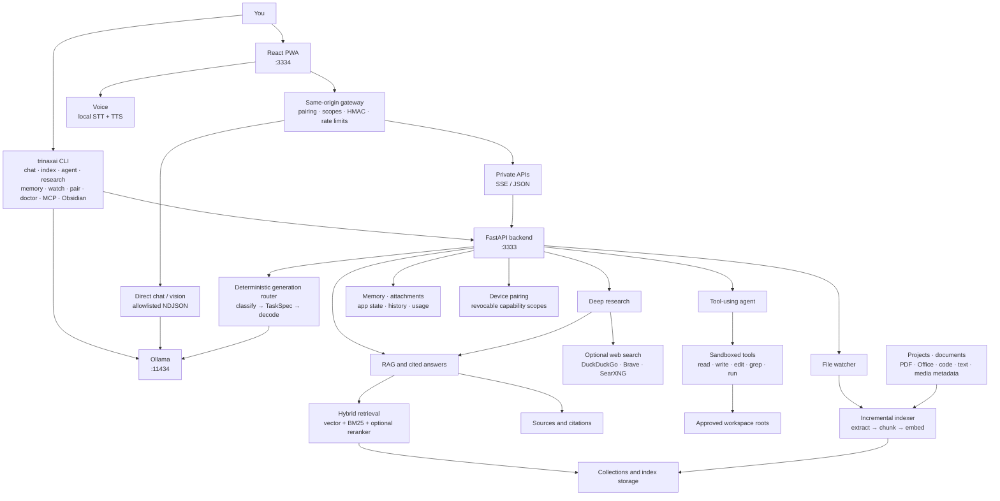

# 🚀 TrinaxAI — Local-First AI Assistant

<p align="center">
  
</p>

<p align="center">
  <strong>Open-source, local-first AI assistant with RAG, a tool-using coding agent, vision, voice, a CLI, and an installable PWA.</strong><br>
  Inference and your data stay on your machine by default. No cloud account, no subscription.
</p>

<p align="center">
  <a href="LICENSE"></a>
  <a href="CHANGELOG.md"></a>
  <a href="https://github.com/TrinaxCode/TrinaxAI/pkgs/container/trinaxai"></a>
  <a href="#-quick-start"></a>
  <a href="#️-supported-platforms"></a>
  <a href="chat-pwa/README.md"></a>
  <a href="README.es.md"></a>
</p>

> **⭐ If TrinaxAI helps you, please star the repo — it helps others find it.**

[**Español →**](README.es.md)

---

## 🚀 Quick Start

**Install in one command, then open the app.** TrinaxAI installs Python/Node deps, Ollama, downloads a model set matched to your RAM, and starts the services.

### Linux / macOS

```bash
git clone https://github.com/TrinaxCode/TrinaxAI.git
cd TrinaxAI
./install.sh
```

Or one line (review the script first — see the security note below):

```bash
curl -fsSL https://raw.githubusercontent.com/TrinaxCode/TrinaxAI/main/install.sh | bash
```

### Windows (PowerShell)

```powershell
git clone https://github.com/TrinaxCode/TrinaxAI.git
cd TrinaxAI
powershell -ExecutionPolicy Bypass -File .\install.ps1
```

The Windows installer pulls dependencies automatically; Ollama is installed via `winget` (with the official silent installer as fallback).

### Docker backend

Every release publishes the RAG API image to GitHub Container Registry. The
PWA gateway and Ollama still run on the host:

```bash
docker pull ghcr.io/trinaxcode/trinaxai:1.0.0
```

Use it with the included `compose.yaml` by setting `TRINAXAI_DOCKER_IMAGE`.
The complete loopback-only setup is in the [Linux installation guide](docs/INSTALL_LINUX.md#optional-docker-backend).

### Open the app

When the installer finishes, open the PWA:

```
https://localhost:3334
```

That's it. The first run shows an onboarding wizard (language, theme, model). The app talks to a local RAG API on `:3333` and a local Ollama on `:11434` — all on your machine.

> **Security note:** before piping any script to `bash`, review it: `curl -fsSL URL | less`, or clone and run locally.

### Install options

```bash
./install.sh --non-interactive        # Unattended install (CI/scripts)
./install.sh --no-models              # Skip model downloads
./install.sh --profile 16gb           # Force a hardware profile
```

| Flag | Description |
|------|-------------|
| `--interactive` | Guided install; asks optional choices (default) |
| `--non-interactive` | Unattended install for CI/scripts |
| `--no-models` | Skip downloading Ollama models |
| `--no-vision` | Compatibility flag; vision models download on first image analysis |
| `--no-autostart` | Do not enable boot auto-start |
| `--no-auto-update` | Do not enable the weekly release check |
| `--no-start` | Do not start TrinaxAI after install |
| `--profile 8gb\|16gb\|max\|ultra` | Override the auto-detected hardware profile |
| `--lan-system` | Enable the legacy LAN system-control fallback (generates an admin token) |

The installer auto-detects your RAM and picks a **hardware profile** (`8gb`, `16gb`, `max`, `ultra`) that decides which Ollama models are pulled. See [Models & profiles](#-models--profiles).

Full platform guides: [Linux](docs/INSTALL_LINUX.md) · [macOS](docs/INSTALL_MACOS.md) · [Windows](docs/INSTALL_WINDOWS.md)
<br>Guías en español: [Linux](docs/INSTALL_LINUX.es.md) · [macOS](docs/INSTALL_MACOS.es.md) · [Windows](docs/INSTALL_WINDOWS.es.md)

### Update & uninstall

```bash
./update.sh      # Guided update; keeps your data, asks about backup/models/restart
./uninstall.sh   # Guided uninstall; asks before removing each item
```

```powershell
powershell -ExecutionPolicy Bypass -File .\update.ps1
powershell -ExecutionPolicy Bypass -File .\uninstall.ps1
```

Updates keep your local data. The optional weekly task is **check-only**: it compares your installed revision against GitHub and writes availability to `logs/auto-update.log` — it never downloads or runs anything unattended. You run the guided updater yourself after reviewing the release.

### Connect another device through the PWA

Any phone, tablet, or computer on the same private network can open
`https://HOST-LAN-IP:3334`. The PWA itself guides the secure connection:

1. On the host computer, open **TrinaxAI → Settings → Paired device** and select
   **Generate pairing code**.
2. On the other device, open the PWA using the host's LAN IP, choose **I already
   have TrinaxAI on another device**, and enter the one-time code.
3. Name the device and confirm pairing. You can then install the PWA from the
   browser's **Add to Home Screen / Install app** action.
4. Back on the host, review or revoke devices under **Settings → Paired device**.

The local HTTPS certificate must be trusted on each device. A LAN device can
reach basic chat before pairing, but RAG, synchronized history, memory, files,
indexing, the agent, and system controls require explicit device permissions.
The host PWA generates a full-interface code with
`chat,read_private,index,system,agent`; use `trinaxai pair start --scopes ...`
for a least-privilege device (the CLI default is `chat,read_private`). The host
can revoke access immediately. See the complete
[PWA pairing guide](chat-pwa/README.md#pairing-a-browser).

---

## What is TrinaxAI?

TrinaxAI is a **local-first AI assistant** that runs entirely on your own hardware. It bundles:

- an **installable conversational PWA** for desktop, phone, and tablet,
- a **developer CLI** (`trinaxai`) with a private, local tool-using coding agent,
- a **RAG engine** that indexes your projects and answers with cited code/document context,
- **voice** (speech-to-text + text-to-speech) and **vision** (image analysis) using local models.

Inference and persisted data stay on the configured host by default. Only explicit actions use the network: installation, model downloads, opt-in web search, or a deliberately remote Ollama/search endpoint.

Every device uses explicit capabilities. The host computer authorizes paired
devices and decides whether they may only chat/read private data or also index
files, run the agent, or control services. Operating-system permissions still
apply on the host: TrinaxAI cannot access a folder, microphone, camera, or shell
operation that the current user or browser has not permitted.

---

## ✨ Features

- 🧠 **Dual engines** — direct Ollama chat (fast, creative) and RAG (grounded, cited answers over your files).
- 🎯 **Intelligent generation pipeline** — a deterministic, no-LLM classifier reads each turn and picks the right model, decoding params, and prompt style (code, reasoning/math, creative, grounded-QA, or explain). Fast and predictable, no extra model call.
- 🤖 **Tool-using agent** — `trinaxai agent` and the in-app Agent view use sandboxed `read/write/edit/list/glob/grep/run_command` tools, remain confined to a workspace, and request approval for dangerous actions.
- 📇 **Custom RAG** — indexes your projects; AST-aware chunking for 15+ languages, hybrid vector + BM25 retrieval, optional cross-encoder reranker, citations back to `rel_path`.
- 🔎 **Deep research** — multi-pass RAG decomposition (`trinaxai research` or the in-app trigger).
- 🌍 **Optional web search** — enable Internet mode for current results through DuckDuckGo, Brave Search, or SearXNG; sources are displayed and public-page reads are bounded.
- 🗂️ **Knowledge collections** — separate RAG spaces; query one or many.
- 🔊 **Optional interface sounds** — one persistent Settings switch controls centralized, non-overlapping cues; disabled means no cue audio is initialized.
- 👀 **File watcher** — auto-reindex folders as they change.
- 🧭 **Local memory** — "remember that…" facts persist locally and sync across your devices.
- 🎤 **Voice mode** — local STT + TTS, including a hands-free voice-call view in the PWA.

### Web search

Web search defaults to `auto`: Brave is used when `TRINAXAI_BRAVE_SEARCH_API_KEY` is set, then a configured `TRINAXAI_SEARXNG_URL`, otherwise DuckDuckGo works without a key. Configure it without a terminal under **Settings → Web search**: enable/disable search, choose DuckDuckGo/Brave/SearXNG, save a Brave key in the host-only private settings file, set a public SearXNG URL, and test the connection. Environment variables take precedence and appear as externally managed; their values are never returned to the browser. Force a provider with `TRINAXAI_WEB_SEARCH_PROVIDER=duckduckgo|brave|searxng`, or disable it with `disabled`. Queries leave the machine only when Internet search is requested; DuckDuckGo may temporarily block automation, Brave requires a key, and SearXNG must expose JSON search. `TRINAXAI_WEB_SEARCH_TIMEOUT` and `TRINAXAI_WEB_SEARCH_MAX_RESULTS` control bounded requests. See [configuration](docs/CONFIGURATION.md).

### Voice

Install the optional local engines with `pip install -e ".[voice]"`. STT uses faster-whisper (models download on first use); TTS uses the platform speech engine through pyttsx3. Linux may require system speech/audio packages, macOS and Windows require microphone permission, and headless systems may report unavailable hardware. Check `GET /v1/voice/capabilities` before enabling controls. If unavailable, verify the extra is installed, microphone permissions, model download access, and the host audio service; API availability does not prove real hardware operation.

### Agent folder browsing

Folder browsing exposes local directory structure only on loopback or to a paired device with the required scope. It does not grant command execution: the user still selects a workspace and dangerous tools retain approval/sandbox checks. Grant the minimum `agent`/`system` scopes needed.
- 📸 **Vision** — analyze images and screenshots with a local vision model.
- 💻 **Developer CLI** — `ask`, `chat`, `index`, `agent`, `research`, `doctor`, and more.
- 🔗 **Cross-device sync** — settings, history, and memory sync across paired devices via the local backend (no cloud).
- 🌐 **Bilingual** — Spanish & English, auto-detected; replies match the language you write in.
- 📱 **Installable PWA** — iOS, Android, desktop; offline shell; dark/light theme.
- 📎 **Documents and attachments** — upload images and documents, extract bounded text for the current turn, and keep host-backed attachment references available to paired devices.
- 🔄 **State and usage sync** — versioned settings/history synchronization with conflict-safe revisions, explicit deletes, and local usage statistics.
- 🛡️ **Local-first security** — loopback services, scoped device pairing, HMAC-signed gateway, sandboxed agent.

**Project version:** 1.0.0 · **License:** [AGPL-3.0-or-later](LICENSE)

---

## 🧭 How it works

TrinaxAI is a local stack with a LAN-facing PWA gateway, a FastAPI backend, and Ollama. Every request is routed through the capability-aware gateway; private operations require a paired device scope, and Ollama is exposed only through an allowlisted facade.



A normal chat turn is classified locally and sent to the best configured model. A RAG turn retrieves from the selected collections, optionally reranks the candidates, and asks Ollama to synthesize a **cited** answer. Research combines multiple local retrieval passes with optional web sources; the agent operates only inside approved workspace roots. The watcher keeps indexes current, while memory, attachments, history, settings, pairing, and usage remain host-backed and sync only to authorized devices. `service_manager.py` supervises services across Linux, macOS, and Windows (systemd / launchctl / subprocess).

The default `16gb` general model is `qwen3.5:4b`, selected for better Spanish
conversation quality; `qwen3.5:2b` remains for greetings and trivial requests.
the deterministic auto-router uses configured code/deep/fast models when the
task requires them. Large uploads become durable background jobs with real
stage/page/chunk/batch progress, bounded timeouts, cancellation, reconnectable
status, and safe retry. Search/RAG provider, index, stream, and first-token
failures leave the UI in a recoverable error state instead of loading forever.
See [Configuration](docs/CONFIGURATION.md).

See [docs/ARCHITECTURE.md](docs/ARCHITECTURE.md) for the full design and data flow.

---

## 🖥️ Supported platforms

| OS | Installer | Service manager | Status |
|---|---|---|---|
| **Linux** (Ubuntu, Debian, Fedora, Arch) | `install.sh` | user systemd | Ready to install and use |
| **macOS** (Intel + Apple Silicon) | `install.sh` | launchctl | Ready to install and use |
| **Windows** (10/11, PowerShell) | `install.ps1` | subprocess supervisor | Ready to install and use |

Runs on CPU — no GPU required. Performance scales with RAM and model size.

---

## 💻 CLI

```bash
pip install -e .          # install the CLI from the repo root

trinaxai                  # interactive REPL (auto-routes chat · web · research · agent · RAG)
trinaxai ask "..."        # one-shot question
trinaxai chat             # interactive chat session
trinaxai chat --engine rag   # force grounded RAG answers
trinaxai index .          # index the current directory
trinaxai agent --workspace . # tool-using local coding agent
trinaxai research --query "..." --depth 2
trinaxai browse list-collections
trinaxai collections list
trinaxai memory list
trinaxai watch start --paths . --collection default
trinaxai pair start       # pair a LAN browser with least-privilege scopes
trinaxai doctor           # system health check
trinaxai doctor --strict --json   # deterministic gate for automation
trinaxai start | stop | status    # service lifecycle
trinaxai export           # export a conversation to Markdown
```

Other top-level commands are `browse`, `collections`, `memory`, `watch`,
`pair`, `obsidian`, `models`, `config`, `restart`, `update`, `uninstall`,
`version`, and `help`. The default CLI engine is Ollama; use `--engine rag` when
indexed context is required.

Inside interactive `trinaxai` or `trinaxai chat`, type `/` to see the command
menu. Available slash commands are `/help`, `/exit` (`/quit`), `/clear`,
`/chat` (`/general`, `/ollama`), `/agent`, `/web`, `/research`, `/rag`, `/auto`,
`/model`, `/workspace`, `/yolo`, `/index`, `/memory`, `/collections`, `/watch`,
and `/status`. Full syntax, subcommands, and TOML config:
[docs/CLI_REFERENCE.md](docs/CLI_REFERENCE.md).

---

## 🧠 Models & profiles

The installer picks a **hardware profile** from your RAM. The supported installer profiles are `8gb`, `16gb`, `max`, and `ultra`; everything is overridable in `.env`.

| Role | Low (`8gb`) | Medium (`16gb`) | High (`max`) | Ultra |
|---|---|---|---|---|
| **Chat / reasoning** | `qwen3.5:2b` | `qwen3.5:4b` | `qwen3.5:9b` | `qwen3.5:35b` (MoE) |
| **Code** | `qwen3.5:2b` | `qwen3.5:4b` | `qwen3.5:9b` | `qwen3-coder:30b` (MoE) |
| **Deep** | `qwen3.5:2b` | `qwen3.5:4b` | `qwen3.5:9b` | `qwen3.5:35b` (MoE) |
| **Vision** | `qwen3.5:2b` | `qwen3.5:4b` | `qwen3.5:9b` | `qwen3.5:35b` (MoE) |
| **Fast** | `qwen3.5:2b` | `qwen3.5:2b` | `qwen3.5:2b` | `qwen3.5:4b` |
| **Embeddings** | `qwen3-embedding:0.6b` (1024d) | `qwen3-embedding:0.6b` | `qwen3-embedding:0.6b` | `qwen3-embedding:0.6b` |

The **generation pipeline** routes each request across the profile's general, deep, code, and fast roles. Qwen3.5 also handles vision, avoiding a second resident VL model. Vision models are downloaded on first image analysis, so installation and updates do not block on a large pull. Confirm names with `ollama list` and adjust `.env` if you change models. See [docs/CONFIGURATION.md](docs/CONFIGURATION.md) and [docs/ENVIRONMENT_VARIABLES.md](docs/ENVIRONMENT_VARIABLES.md).

---

## 🔒 Security model

TrinaxAI is **local-first by design.**

| Layer | Default | How to harden |
|-------|---------|---------------|
| **RAG API** | Loopback-only, behind the same-host gateway | Keep `TRINAXAI_HOST=127.0.0.1`; expose the PWA over trusted LAN/VPN only |
| **Gateway identity** | Client identity signed with an install HMAC secret | Keep `storage/.proxy_secret` at mode `0600` |
| **Device pairing** | One-time code grants `chat,read_private` | Grant `index`/`system`/`agent` only when needed; revoke lost devices |
| **Admin/private data** | Direct loopback, matching device scope, or admin token | Keep `TRINAXAI_ADMIN_TOKEN` on the host; don't paste it into browsers |
| **Ollama** | Loopback-only; gateway exposes a narrow allowlist | Never publish port 11434 or a generic proxy |
| **PWA** | HTTPS with a generated local cert | Trust the cert per device, or front it with nginx/Caddy + Let's Encrypt |
| **Agent** | File tools confined to registered roots; Linux shell uses networkless bubblewrap | Keep HTTP yolo disabled; never enable the unsandboxed escape hatch remotely |
| **CORS** | localhost + your LAN IP | Customize via `TRINAXAI_CORS_ORIGINS` |

For LAN/remote access: use a firewall to block ports 3333/11434, a VPN (Tailscale/WireGuard) rather than exposing ports, and `trinaxai pair start` with minimal scopes. Full threat model and reporting: [SECURITY.md](SECURITY.md).

---

## 🧪 Development

```bash
git clone https://github.com/TrinaxCode/TrinaxAI.git
cd TrinaxAI

# Backend
python3 -m venv .venv && source .venv/bin/activate
pip install -r requirements.txt
python rag_api.py                     # serves app.main:app on :3333

# PWA
cd chat-pwa && npm install && npm run dev   # :3334

# CLI (editable)
pip install -e . && trinaxai doctor
```

Common tasks are wrapped in the `Makefile` (`make dev`, `make build`, `make lint`, `make test`, `make check`). Full setup: [docs/DEVELOPER_GUIDE.md](docs/DEVELOPER_GUIDE.md).

---

## 📚 Documentation

Start at the [documentation hub](docs/README.md). Key references:

| Topic | Doc |
|---|---|
| Architecture & data flow | [docs/ARCHITECTURE.md](docs/ARCHITECTURE.md) |
| Configuration | [docs/CONFIGURATION.md](docs/CONFIGURATION.md) |
| Environment variables | [docs/ENVIRONMENT_VARIABLES.md](docs/ENVIRONMENT_VARIABLES.md) |
| CLI reference | [docs/CLI_REFERENCE.md](docs/CLI_REFERENCE.md) |
| HTTP API | [docs/API_REFERENCE.md](docs/API_REFERENCE.md) |
| Developer guide | [docs/DEVELOPER_GUIDE.md](docs/DEVELOPER_GUIDE.md) |
| PWA frontend | [chat-pwa/README.md](chat-pwa/README.md) |
| Install (Linux/macOS/Windows) | [Linux](docs/INSTALL_LINUX.md) · [macOS](docs/INSTALL_MACOS.md) · [Windows](docs/INSTALL_WINDOWS.md) |

The PWA also ships **in-app documentation** (open **Docs** from the sidebar) covering install, config, models, indexing, security, the API, and the phone setup guide.

---

## 📁 Project structure

| Path | Purpose |
|------|---------|
| `app/main.py` | FastAPI app factory and middleware |
| `app/routes/` · `app/services/` | Domain routers and backend services |
| `app/generation/` | Intelligent generation pipeline (classifier, scoring, presets, prompts, validate) |
| `rag_api.py` | Backward-compatible API entry point (re-exports `app.main:app`) |
| `index.py` | Project indexer — AST chunking, incremental mode |
| `config.py` | Central config — models, profiles, chunking, retrieval |
| `trinaxai_cli/` | Modular CLI package |
| `trinaxai_cli/agent/` | Sandboxed tool-using agent (engine + tools) |
| `service_manager.py` | Cross-platform start/stop/status/watch supervisor |
| `install.sh` · `install.ps1` | One-command installers |
| `update.sh` · `uninstall.sh` · `backup.sh` | Maintenance scripts (`.ps1` on Windows) |
| `chat-pwa/` | React PWA frontend ([README](chat-pwa/README.md)) |
| `docs/` | Documentation set |

---

## 📚 FAQ

**Does TrinaxAI send my data to the cloud?**
No, not by default. Inference uses the loopback Ollama instance and RAG data stays on the host. Only installation, model downloads, and opt-in web research contact the network. If you deliberately point Ollama/search targets at another host, those requests follow your configuration.

**Do I need a GPU?**
No. Ollama runs on CPU. The `8gb` profile uses small models tuned for CPU inference.

**Can I use it from another device?**
Yes. Generate a one-time code in the host PWA settings, open
`https://HOST-LAN-IP:3334` on the other device, and enter it. Same WiFi alone
does not grant access to private data or privileged functions.

**Can I index my whole Documents folder?**
Yes. Beyond source code, the indexer extracts text from PDF/Office docs, Markdown/text/data files, HTML, EPUB, email, subtitles, calendars, contacts, and notebooks. Re-indexing is incremental; binary/media files are skipped.

**What license?**
AGPL-3.0-or-later — free for personal and commercial use. See [LICENSE](LICENSE) and [TRADEMARK.md](TRADEMARK.md).

---

---

## 🤝 Contributing

PRs welcome — see [CONTRIBUTING.md](CONTRIBUTING.md). Report bugs · suggest features · improve docs · translate · submit PRs.

---

## 📄 License

AGPL-3.0-or-later — see [LICENSE](LICENSE). Name/logo usage: [TRADEMARK.md](TRADEMARK.md).

---

<p align="center">
  <strong>Built by <a href="https://github.com/TrinaxCode">TrinaxCode</a></strong><br>
  <sub>AI should be free, private, and local.</sub>
</p>
