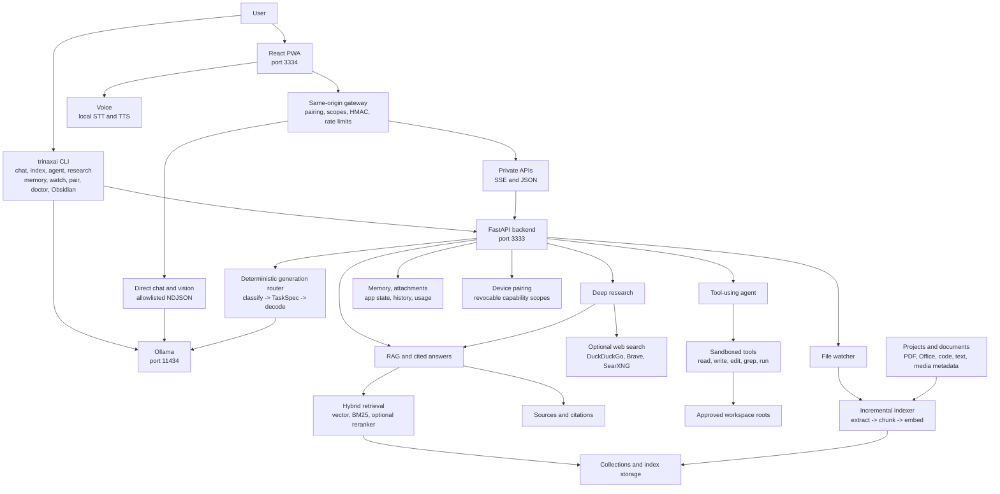

<h1 align="center">
  <a href="https://www.trinaxai.app/"></a>
  <a href="https://www.trinaxai.app/">TrinaxAI</a>
</h1>

<p align="center">
  <a href="https://github.com/TrinaxCode/TrinaxAI"></a>
  <a href="https://github.com/TrinaxCode/TrinaxAI/releases/tag/v1.2.0"></a>
  <a href="https://github.com/TrinaxCode/TrinaxAI/actions/workflows/ci.yml"></a>
  <a href="https://github.com/TrinaxCode/TrinaxAI/blob/main/LICENSE"></a>
  
</p>

<p align="center"><sub><strong>English</strong> · <a href="README.es.md">Español</a></sub></p>
<p align="center"><sub><a href="https://www.trinaxai.app/">Website</a> · <a href="docs/README.md">Documentation</a> · <a href="docs/CHANGELOG.md">Changelog</a> · <a href="LICENSE">License</a></sub></p>

<p align="center"><strong>A local-first AI assistant for working with your files on your own computer, with RAG, a sandboxed coding agent, and secure device pairing.</strong></p>

<p align="center">
  <a href="https://www.trinaxai.app/"></a>
</p>

If TrinaxAI helps you, consider [starring the repository](https://github.com/TrinaxCode/TrinaxAI).

## Contents

- [Quick start](#quick-start)
- [What is TrinaxAI?](#what-is-trinaxai)
- [Capabilities](#capabilities)
- [How it works](#how-it-works)
- [Supported platforms](#supported-platforms)
- [CLI](#cli)
- [Models and hardware profiles](#models-and-hardware-profiles)
- [VS Code and Continue.dev](#vs-code-and-continuedev)
- [Security model](#security-model)
- [Troubleshooting and recovery](docs/TROUBLESHOOTING.md)
- [Development](#development)
- [Documentation](#documentation)
- [Project structure](#project-structure)
- [FAQ](#faq)
- [Contributing and license](#contributing-and-license)

## Quick start

The normal installation uses a release-pinned installer and does not require Git.

Linux or macOS:

> Release status: `v1.2.0` is the current candidate, but its GitHub Release assets are not published yet. For immediate testing, copy this tree to the target Linux/macOS machine and run `bash install.sh`; the installer intentionally refuses to fall back to `main`.

```bash
set -eu
version="1.2.0"
base="https://github.com/TrinaxCode/TrinaxAI/releases/download/v${version}"
installer="$(mktemp)"
manifest="$(mktemp)"
trap 'rm -f "$installer" "$manifest"' EXIT
curl --fail --location --output "$installer" "${base}/TrinaxAI-${version}-installer.sh"
curl --fail --location --output "$manifest" "${base}/SHA256SUMS"
expected="$(awk -v asset="TrinaxAI-${version}-installer.sh" '$2 == asset || $2 == "*" asset { print $1; exit }' "$manifest")"
if command -v sha256sum >/dev/null 2>&1; then actual="$(sha256sum "$installer" | awk '{print $1}')"; elif command -v shasum >/dev/null 2>&1; then actual="$(shasum -a 256 "$installer" | awk '{print $1}')"; else echo "A SHA-256 tool (sha256sum or shasum) is required." >&2; exit 2; fi
if [ -z "$expected" ] || [ "$actual" != "$expected" ]; then echo "Installer SHA-256 verification failed." >&2; exit 1; fi
bash -n "$installer"
bash "$installer"
```

Windows PowerShell:

> Release status: `v1.2.0` is the current candidate, but its GitHub Release assets are not published yet. For immediate Windows testing, copy this tree to Windows and run `powershell -ExecutionPolicy Bypass -File .\install.ps1`; the installer intentionally refuses to fall back to `main`.

```powershell
$ErrorActionPreference = "Stop"
$version = "1.2.0"
$base = "https://github.com/TrinaxCode/TrinaxAI/releases/download/v$version"
$installer = Join-Path $env:TEMP "TrinaxAI-$version-installer.ps1"
$manifest = Join-Path $env:TEMP "TrinaxAI-$version-SHA256SUMS"
Invoke-WebRequest -Uri "$base/TrinaxAI-$version-installer.ps1" -OutFile $installer
Invoke-WebRequest -Uri "$base/SHA256SUMS" -OutFile $manifest
$line = Get-Content -LiteralPath $manifest | Where-Object { $_ -match "\s\*?TrinaxAI-$version-installer\.ps1$" } | Select-Object -First 1
$expected = if ($line -match '^\s*([0-9a-fA-F]{64})\s+') { $Matches[1] } else { "" }
$actual = (Get-FileHash -Algorithm SHA256 -LiteralPath $installer).Hash
if ($expected -notmatch '^[0-9a-fA-F]{64}$' -or $actual -ine $expected) { throw "Installer SHA-256 verification failed." }
Get-Content -Path $installer
& $installer
```

The SHA-256 manifest check above is required before executing a release installer; it checks integrity but does not authenticate the release. Detached GPG verification is an optional additional check only when you have independently obtained and trusted the signing-key fingerprint; a key or fingerprint downloaded from the same release is not an authenticity anchor. See [release signing](docs/RELEASE_SIGNING.md). The repository does not yet ship a pinned public-key trust anchor.

A local checkout run (`./install.sh` or `./install.ps1`) remains available for operator/development use and is intentionally not blocked; review and protect that checkout separately.

The installer downloads the TrinaxAI source archive directly from GitHub, installs the required tools, detects your hardware, configures Ollama, builds the PWA, and starts the local app. When it finishes, open `https://localhost:3334`.

## Advanced installation and automation

The commands below are optional reviewed or automated variants of the same URL-based installer.

### Terminal fallback: Linux and macOS

Download the script, inspect it, and then run it:

```bash
set -eu
installer="$(mktemp)"
manifest="$(mktemp)"
trap 'rm -f "$installer" "$manifest"' EXIT
version="1.2.0"
base="https://github.com/TrinaxCode/TrinaxAI/releases/download/v${version}"
curl --fail --location --output "$installer" "${base}/TrinaxAI-${version}-installer.sh"
curl --fail --location --output "$manifest" "${base}/SHA256SUMS"
expected="$(awk -v asset="TrinaxAI-${version}-installer.sh" '$2 == asset || $2 == "*" asset { print $1; exit }' "$manifest")"
if command -v sha256sum >/dev/null 2>&1; then actual="$(sha256sum "$installer" | awk '{print $1}')"; elif command -v shasum >/dev/null 2>&1; then actual="$(shasum -a 256 "$installer" | awk '{print $1}')"; else echo "A SHA-256 tool (sha256sum or shasum) is required." >&2; exit 2; fi
if [ -z "$expected" ] || [ "$actual" != "$expected" ]; then echo "Installer SHA-256 verification failed." >&2; exit 1; fi
bash -n "$installer"
less "$installer"
bash "$installer"
```

### Terminal fallback: Windows

Download, inspect, and run the guided installer from PowerShell:

```powershell
$ErrorActionPreference = "Stop"
$version = "1.2.0"
$base = "https://github.com/TrinaxCode/TrinaxAI/releases/download/v$version"
$installer = Join-Path $env:TEMP "TrinaxAI-$version-installer.ps1"
$manifest = Join-Path $env:TEMP "TrinaxAI-$version-SHA256SUMS"
Invoke-WebRequest -Uri "$base/TrinaxAI-$version-installer.ps1" -OutFile $installer
Invoke-WebRequest -Uri "$base/SHA256SUMS" -OutFile $manifest
$line = Get-Content -LiteralPath $manifest | Where-Object { $_ -match "\s\*?TrinaxAI-$version-installer\.ps1$" } | Select-Object -First 1
$expected = if ($line -match '^\s*([0-9a-fA-F]{64})\s+') { $Matches[1] } else { "" }
$actual = (Get-FileHash -Algorithm SHA256 -LiteralPath $installer).Hash
if ($expected -notmatch '^[0-9a-fA-F]{64}$' -or $actual -ine $expected) { throw "Installer SHA-256 verification failed." }
Get-Content -Path $installer
& $installer
```

It downloads the GitHub source archive to `%LOCALAPPDATA%\TrinaxAI`.

The Windows installer pulls dependencies automatically. It tries the official Ollama installer first, verifies the signed `OllamaSetup.exe` fallback when needed, and uses `winget` as a final fallback.

### Docker backend

Every release publishes the RAG API image to GitHub Container Registry. The PWA gateway and Ollama continue to run on the host.

```bash
docker pull ghcr.io/trinaxcode/trinaxai:1.2.0
```

Use the image with the included `compose.yaml` by setting `TRINAXAI_DOCKER_IMAGE`. The complete loopback-only setup is documented in the [Linux installation guide](docs/INSTALL_LINUX.md#optional-docker-backend).

Security note for advanced installation: review downloaded scripts before executing them.

### Advanced install options

```bash
./install.sh --non-interactive        # Unattended install for CI or scripts
./install.sh --no-models              # Require configured models to be preinstalled
./install.sh --profile 16gb           # Force a hardware profile
```

| Option | Description |
| --- | --- |
| `--interactive` | Guided install with optional choices. This is the default. |
| `--non-interactive` | Unattended install for CI and scripts. |
| `--no-models` | Skip downloads, but require every configured Ollama model to already be installed. |
| `--no-vision` | Compatibility option. Vision models still download on first image analysis. |
| `--no-autostart` | Do not enable start on boot. |
| `--no-auto-update` | Do not enable the weekly release check. |
| `--no-start` | Prepare the installation without starting TrinaxAI or advertising its URLs as live. |
| `--profile PROFILE` | Override the detected hardware profile with `8gb`, `16gb`, `32gb`, or `64gb`. |
| `--lan-system` | Deprecated compatibility option. It is ignored and never enables LAN host administration. |

The installer detects CPU, RAM, GPU, and VRAM, then selects one of the `8gb`, `16gb`, `32gb`, or `64gb` profiles. The profile and hardware combination determine which Ollama models are downloaded. See [Models and hardware profiles](#models-and-hardware-profiles).

Platform guides: [Linux](docs/INSTALL_LINUX.md), [macOS](docs/INSTALL_MACOS.md), and [Windows](docs/INSTALL_WINDOWS.md).

Spanish guides: [Linux](docs/INSTALL_LINUX.es.md), [macOS](docs/INSTALL_MACOS.es.md), and [Windows](docs/INSTALL_WINDOWS.es.md).

### Update and uninstall

From any terminal, manage the installation with the built-in CLI. Git is not required:

```bash
./update.sh      # Guided update; keeps data and asks about backup, models, and restart
./uninstall.sh   # Guided uninstall; asks before removing each item
```

```powershell
powershell -ExecutionPolicy Bypass -File .\update.ps1
powershell -ExecutionPolicy Bypass -File .\uninstall.ps1
```

Updates keep local data. The optional weekly task is check-only: it compares the installed version with GitHub's latest stable release and writes availability to `logs/auto-update.log`. It never downloads or runs anything unattended. Run the guided updater yourself after reviewing the release.

To stop the complete stack, use **Stop all** in the PWA or `trinaxai stop --all`. Only the loopback recovery page remains at `https://localhost:3334`; LAN access stays closed until you start TrinaxAI there again.

### Pair another device

Any phone, tablet, or computer on the same private network can open `https://HOST-LAN-IP:3334`. The PWA guides the secure connection:

1. On the host, open **TrinaxAI > Settings > Paired device** and select **Generate pairing code**.
2. On the other device, open the PWA with the host LAN IP, choose **I already have TrinaxAI on another device**, and enter the one-time code.
3. Name the device and confirm pairing. Install the PWA from the browser's **Add to Home Screen** or **Install app** action.
4. On the host, review or revoke devices from **Settings > Paired device**.

The local HTTPS certificate must be trusted on each device. Run `trinaxai network` after `trinaxai network refresh` to see the public certificate path and follow the [LAN pairing and HTTPS trust guide](docs/NETWORK_PAIRING.md). A remote browser must pair before it can use chat or private APIs. Pairing may grant only `chat`, `read_private`, and `web`; `read_private` enables authorized RAG, synchronized history, memory context, files, and other private reads.

Indexing, memory/configuration writes, the Agent, model installation/deletion, lifecycle controls, factory reset, and device administration are host-only. Open `https://localhost:3334` on the host for those actions; an admin token or an old device token containing `system`, `index`, or `agent` cannot authorize them from LAN. The CLI pairing default is `chat,read_private`, and the host can revoke access immediately. See the complete [PWA pairing guide](chat-pwa/README.md#pairing-a-browser).

## What is TrinaxAI?

TrinaxAI is a local-first AI assistant that runs on your own hardware.

Most local AI tools are Ollama wrappers. TrinaxAI combines a local RAG engine with AST-aware chunking, hybrid vector and BM25 retrieval, an optional reranker, and cited answers. It also includes a sandboxed tool-using coding agent and capability-scoped device pairing, packaged with a CLI, an installable PWA, and cross-device synchronization.

### At a glance

| Area | Default |
| --- | --- |
| Interfaces | Installable PWA and developer CLI |
| AI runtime | Local Ollama |
| RAG API | Local service on port `3333` |
| PWA | `https://localhost:3334` |
| Device access | Pairing with revocable capability scopes |
| Data location | Configured host, unless an explicit remote endpoint is selected |
| Platforms | Linux, macOS, and Windows |
| Version | `1.2.0` |
| License | [AGPL-3.0-or-later](LICENSE) |

Inference and persisted data stay on the configured host by default. The network is used only for explicit actions such as installation, model downloads, opt-in web search, or a deliberately remote Ollama or search endpoint.

Every paired device uses explicit low-risk capabilities for chat, private reads, and optional web search. Host administration, indexing, and Agent workspace access always require a verified loopback connection. Operating-system permissions still apply: TrinaxAI cannot access a folder, microphone, camera, or shell operation that the current user or browser has not permitted.

## Capabilities

- **Dual engines:** direct Ollama chat for fast, creative responses and RAG for grounded, cited answers over your files.
- **Intelligent generation pipeline:** a deterministic, no-LLM classifier selects the model, decoding parameters, and prompt style for code, reasoning and math, creative work, grounded QA, or explanations. It adds no extra model call.
- **Tool orchestration:** the in-app Agent can combine web search, deep research, memory, indexed-document search, collections, and sandboxed workspace tools. Tool switches restrict availability but never force execution. Dangerous actions still require approval.
- **Custom RAG:** indexes projects with AST-aware chunking for 16 code languages, text fallback for additional formats, hybrid vector and BM25 retrieval, an optional cross-encoder reranker, and citations back to `rel_path`.
- **Deep research:** multi-pass RAG decomposition through `trinaxai research` or the in-app trigger.
- **Optional web search:** current results through DuckDuckGo, Brave Search, or SearXNG, with displayed sources and bounded public-page reads.
- **Knowledge collections:** separate RAG spaces that can be queried individually or together.
- **Interface sounds:** one persistent Settings switch controls centralized, non-overlapping cues. When disabled, no cue audio is initialized.
- **File watcher:** automatically re-indexes folders as they change.
- **Local memory:** facts saved with "remember that..." persist locally and synchronize across paired devices.
- **Voice mode:** local speech-to-text and text-to-speech, including a hands-free voice-call view in the PWA.
- **Vision:** image and screenshot analysis with a local vision model.
- **Developer CLI:** commands including `ask`, `chat`, `index`, `agent`, `research`, and `doctor`.
- **Cross-device sync:** settings, history, and memory synchronize through the local backend with no cloud service.
- **Bilingual interface:** Spanish and English are auto-detected, and replies follow the language you write in.
- **Installable PWA:** works on iOS, Android, and desktop with an offline shell and dark or light theme.
- **Documents and attachments:** uploads images and documents, extracts bounded text for the current turn, and keeps host-backed attachment references available to paired devices.
- **State and usage sync:** versioned settings and history synchronization with conflict-safe revisions, explicit deletes, and local usage statistics.
- **Local-first security:** loopback services, scoped device pairing, an HMAC-signed gateway, and a sandboxed agent.

### Web search

Web search defaults to `auto`: Brave is used when `TRINAXAI_BRAVE_SEARCH_API_KEY` is set, then a configured `TRINAXAI_SEARXNG_URL`, otherwise DuckDuckGo works without a key.

Configure search from **Settings > Web search** without using a terminal. You can enable or disable search, choose DuckDuckGo, Brave, or SearXNG, save a Brave key in the host-only private settings file, set a public SearXNG URL or the documented local `http://127.0.0.1:8080` endpoint, and test the connection.

Environment variables take precedence and appear as externally managed. Their values are never returned to the browser. Force a provider by setting `TRINAXAI_WEB_SEARCH_PROVIDER` to `duckduckgo`, `brave`, or `searxng`, or disable search with `disabled`.

Queries leave the machine only when Internet search is requested. DuckDuckGo may temporarily block automation, Brave requires a key, and SearXNG must expose JSON search. `TRINAXAI_WEB_SEARCH_TIMEOUT` and `TRINAXAI_WEB_SEARCH_MAX_RESULTS` bound requests. See the [configuration reference](docs/CONFIGURATION.md).

### Voice

Install the optional local engines with:

```bash
pip install -e ".[voice]"
```

Speech-to-text uses faster-whisper; models download on first use. Text-to-speech uses the platform speech engine through pyttsx3. Linux may require system speech and audio packages. macOS and Windows require microphone permission. Headless systems may report unavailable hardware.

Check `GET /v1/voice/capabilities` before enabling controls. If voice is unavailable, verify the extra is installed, microphone permissions, model download access, and the host audio service. API availability does not prove real hardware operation.

### Agent folder browsing

Agent folder browsing and workspace tools are host-only and require opening the PWA through loopback. Pairing never grants `agent`, `agent_yolo`, `index`, or `system`; dangerous tools retain approval and sandbox checks.

## How it works

TrinaxAI is a local stack with an optional LAN-facing PWA gateway, a FastAPI backend, and Ollama. PWA requests pass through the capability-aware gateway; the CLI uses the same backend authorization rules. Remote private operations require a paired-device scope, and Ollama is exposed only through an allowlisted facade.


```mermaid
flowchart TB
  user["User"] --> pwa["React PWA<br/>port 3334"]
  user --> cli["trinaxai CLI<br/>chat, index, agent, research<br/>memory, watch, pair, doctor, Obsidian"]
  pwa --> gateway["Same-origin gateway<br/>pairing, scopes, HMAC, rate limits"]
  cli --> api
  cli --> ollama
  gateway --> direct["Direct chat and vision<br/>allowlisted NDJSON"]
  direct --> ollama["Ollama<br/>port 11434"]
  gateway --> private["Private APIs<br/>SSE and JSON"]
  private --> api["FastAPI backend<br/>port 3333"]

  api --> router["Deterministic generation router<br/>classify -> TaskSpec -> decode"]
  router --> ollama
  api --> rag["RAG and cited answers"]
  rag --> retrieve["Hybrid retrieval<br/>vector, BM25, optional reranker"]
  retrieve --> store["Collections and index storage"]
  rag --> citations["Sources and citations"]
  api --> research["Deep research"]
  research --> rag
  research --> web["Optional web search<br/>DuckDuckGo, Brave, SearXNG"]

  api --> agent["Tool-using agent"]
  agent --> tools["Sandboxed tools<br/>read, write, edit, grep, run"]
  tools --> workspace["Approved workspace roots"]
  api --> data["Memory, attachments<br/>app state, history, usage"]
  api --> pairing["Device pairing<br/>revocable capability scopes"]
  api --> watcher["File watcher"]
  watcher --> indexer["Incremental indexer<br/>extract -> chunk -> embed"]
  sources["Projects and documents<br/>PDF, Office, code, text, media metadata"] --> indexer
  indexer --> store
  pwa --> voice["Voice<br/>local STT and TTS"]
```

A normal chat turn is classified locally and sent to the best configured model. A RAG turn retrieves from selected collections, optionally reranks the candidates, and asks Ollama to synthesize a cited answer. Research combines multiple local retrieval passes with optional web sources. The agent operates only inside approved workspace roots.

The watcher keeps indexes current. Memory, attachments, history, settings, pairing, and usage remain host-backed and synchronize only to authorized devices. `service_manager.py` supervises services across Linux, macOS, and Windows using systemd, launchctl, or a subprocess supervisor.

The default `16gb` general model is `qwen3.5:4b`, selected for better Spanish conversation quality. `qwen3.5:2b` remains available for greetings and trivial requests. The deterministic auto-router uses configured code, deep, and fast models when the task requires them.

Large uploads become durable background jobs with stage, page, chunk, and batch progress, bounded timeouts, cancellation, reconnectable status, and safe retry. Search, RAG provider, index, stream, and first-token failures leave the UI in a recoverable error state instead of loading forever. The PWA shows the next action when it can, including **Open indexing**, **Retry**, **Start AI**, and **Open settings**. See the [troubleshooting and recovery guide](docs/TROUBLESHOOTING.md), [Configuration](docs/CONFIGURATION.md), and the full [architecture and data flow](docs/ARCHITECTURE.md).

## Supported platforms

| Operating system | Installer | Service manager | CI coverage |
| --- | --- | --- | --- |
| Linux: Ubuntu, Debian, Fedora, Arch | `install.sh` | User systemd | Backend, CLI, PWA, installer, and E2E checks |
| macOS: Intel and Apple Silicon | `install.sh` | launchctl | Backend, CLI, installer, and shell checks |
| Windows 10 and 11 | `install.ps1` | Subprocess supervisor | Backend, CLI, installer, and PowerShell checks |

CI runs backend and CLI checks on all three platforms, PWA tests/build/E2E on Ubuntu, and installer syntax/dry-run checks on Linux, macOS, and Windows. Full installation testing with real model downloads, service startup, and the first-run wizard remains a machine-level smoke test; follow [TESTING.md](TESTING.md) before calling a platform ready for public beta.

TrinaxAI runs on CPU; no GPU is required. Performance scales with RAM and model size.

## CLI

Install the CLI from the repository root:

```bash
pip install -e .
```

Common commands:

```bash
trinaxai                              # Interactive REPL with automatic routing
trinaxai ask "..."                    # One-shot question
trinaxai chat                         # Interactive chat session
trinaxai chat --engine rag            # Force grounded RAG answers
trinaxai index .                      # Index the current directory
trinaxai agent --workspace .          # Local coding agent with tools
trinaxai research --query "..." --depth 2
trinaxai browse list-collections
trinaxai collections list
trinaxai memory list
trinaxai watch start --paths . --collection default
trinaxai pair start                   # Pair a LAN browser with least privilege
trinaxai doctor                       # System health check
trinaxai doctor --strict --json       # Deterministic automation gate
trinaxai start | stop | status        # Service lifecycle
trinaxai export                       # Export a conversation to Markdown, PDF, or Word
```

Other top-level commands include `browse`, `collections`, `memory`, `watch`, `pair`, `network`, `obsidian`, `models`, `config`, `restart`, `update`, `uninstall`, `version`, and `help`. `trinaxai mcp` is reserved for a future integration and exits with a nonzero status; use the HTTP API or CLI commands in this release.

The default CLI engine is Ollama. Use `--engine rag` when indexed context is required.

Inside interactive `trinaxai` or `trinaxai chat`, type `/` to see the command menu. Available slash commands are `/help`, `/exit` and `/quit`, `/clear`, `/chat`, `/general`, `/ollama`, `/agent`, `/web`, `/research`, `/rag`, `/auto`, `/model`, `/workspace`, `/yolo`, `/index`, `/memory`, `/collections`, `/watch`, and `/status`.

Full syntax, subcommands, and TOML configuration are in the [CLI reference](docs/CLI_REFERENCE.md).

## VS Code and Continue.dev

[Continue.dev](https://www.continue.dev/) is an open-source VS Code extension
for chat, code generation, inline completion, editing, and applying diffs. With
TrinaxAI it gives you two complementary local engines from the editor:

- **TrinaxAI RAG:** cited answers over the projects and documents indexed by TrinaxAI.
- **Ollama direct:** fast chat, code review, edit/apply, autocomplete, and local vision.

### Install and connect

1. Install **Continue - open-source AI code assistant** from the VS Code Extensions view.
2. Start TrinaxAI and Ollama. The default endpoints are `https://localhost:3333/v1` and `http://localhost:11434`.
3. Copy the included configuration to Continue's user directory:

   ```bash
   mkdir -p ~/.continue
   cp continue-config.yaml ~/.continue/config.yaml
   ```

   On Windows, copy it to `%USERPROFILE%\.continue\config.yaml`.
4. Reload VS Code (`Developer: Reload Window`) and open Continue. **TrinaxAI RAG (Primary)** is the default model.

The file is intentionally self-contained. Continue does not interpolate
environment variables in YAML, so it cannot select `TRINAXAI_PROFILE` itself.
The config includes the complete model matrix and marks the three values to
change when selecting a profile. Ollama still needs the selected models:

| Profile | Chat/code | Fast/autocomplete | Embeddings |
| --- | --- | --- | --- |
| `8gb` | `qwen3.5:2b` | `qwen3.5:2b` | `qwen3-embedding:0.6b` |
| `16gb` | `qwen3.5:4b` | `qwen3.5:2b` | `qwen3-embedding:0.6b` |
| `32gb` | `qwen3.5:9b` | `qwen3.5:4b` | `qwen3-embedding:4b` |
| `64gb` | `qwen3.5:35b`, `qwen3-coder:30b` | `qwen3.5:4b` | `qwen3-embedding:4b` |

Use `ollama list` to verify availability. If a model is missing, install it
with `ollama pull MODEL` or run the TrinaxAI model setup/update flow. Do not
keep several large models warm at once on a RAM-limited machine.

### Change the profile

Open `~/.continue/config.yaml` and update the `ACTIVE PROFILE` comments,
`embeddingsProvider.model`, and the `rerank.model` name. Keep
`defaultModel` as **TrinaxAI RAG (Primary)**; select the matching direct Ollama
model in Continue's model picker, for example **Qwen3.5 9B (32GB)**.

To regenerate the file from the installed profile and copy it to Continue, run
`python scripts/generate_continue_config.py --install-user-config`.

After changing embeddings, re-index Continue's `@codebase`; embedding vectors
with different dimensions must not be mixed. TrinaxAI's own index is separate
and is managed by TrinaxAI's profile and `.env` settings.

### Use RAG, code, vision, and autocomplete

- Ask normal questions with **TrinaxAI RAG (Primary)** for grounded answers and file citations.
- Use `@codebase`, `@file`, `@git`, `@diff`, or `@terminal` when the answer should use explicit VS Code context.
- Use `/rag` for a cited indexed-project question, `/code` for implementation/review, `/explain` for explanation, and `/test` for focused regression coverage.
- Select an Ollama profile model for direct chat, edit, or apply operations without TrinaxAI retrieval.
- Keep **Qwen3.5 2B (Fast)** as the tab autocomplete model; it reduces latency and memory pressure.
- Select the vision model matching the profile and attach a screenshot or image in Continue for UI, diagram, and error analysis.

### Troubleshooting

- **RAG is unavailable:** run `trinaxai status` or `trinaxai doctor`, confirm `https://localhost:3333/v1`, and start with `./startup_ai.sh` or `trinaxai start`.
- **TLS/certificate error:** keep `verifySsl: true`; trust TrinaxAI's generated local CA on the operating system, or set a CA bundle in the client environment. Do not disable TLS verification on a LAN endpoint.
- **Ollama model not found:** run `ollama serve`, then `ollama list` and `ollama pull MODEL`.
- **Slow or out-of-memory responses:** select the smaller profile model, reduce concurrent model use, and avoid keeping a large chat model and embedding model resident together.
- **Stale `@codebase` results:** re-index Continue after changing the embedding model or workspace.

For the wider PWA, RAG, model, LAN, and recovery decision table, see the
[troubleshooting and recovery guide](docs/TROUBLESHOOTING.md). The same
configuration and workflow are documented in Spanish in
`README.es.md`. The source file is [`continue-config.yaml`](continue-config.yaml).

## Models and hardware profiles

The installer selects a hardware profile from CPU, RAM, GPU, and VRAM. Supported profiles are `8gb`, `16gb`, `32gb`, and `64gb`. Every setting can be overridden in `.env`.

| Role | 8GB | 16GB | 32GB | 64GB |
| --- | --- | --- | --- | --- |
| Chat and reasoning | `qwen3.5:2b` | `qwen3.5:4b` | `qwen3.5:9b` | `qwen3.5:35b` |
| Code | `qwen3.5:2b` | `qwen3.5:4b` | `qwen3.5:9b` | `qwen3-coder:30b` |
| Deep | `qwen3.5:2b` | `qwen3.5:4b` | `qwen3.5:9b` | `qwen3.5:35b` |
| Vision | `qwen3.5:2b` | `qwen3.5:4b` | `qwen3.5:9b` | `qwen3.5:35b` |
| Fast | `qwen3.5:2b` | `qwen3.5:2b` | `qwen3.5:4b` | `qwen3.5:4b` |
| Embeddings | `qwen3-embedding:0.6b` | `qwen3-embedding:0.6b` | `qwen3-embedding:4b` | `qwen3-embedding:4b` |

The recommendation uses the real combination: an NVIDIA/AMD GPU with enough VRAM can raise the model tier even with less system RAM; otherwise it favors models that fit CPU/RAM. Apple Silicon is treated as unified memory.

The generation pipeline routes each request across the profile's general, deep, code, and fast roles. Qwen3.5 also handles vision, avoiding a second resident vision-language model. Vision models download on first image analysis, so installation and updates do not block on a large pull.

Confirm model names with `ollama list` and adjust `.env` if you change them. See the [configuration reference](docs/CONFIGURATION.md) and [environment variable inventory](docs/ENVIRONMENT_VARIABLES.md).

## Security model

TrinaxAI is local-first by design.

| Layer | Default | How to harden |
| --- | --- | --- |
| RAG API | Loopback-only, behind the same-host gateway | Keep `TRINAXAI_HOST=127.0.0.1`; expose the PWA over a trusted LAN or VPN only. |
| Gateway identity | Client identity signed with an install HMAC secret | Keep `storage/.proxy_secret` at mode `0600`. |
| Device pairing | One-time code grants `chat,read_private` and may add `web` | Revocation is immediate; retired elevated scopes are ignored. |
| Administration and private data | Protected reads use matching credentials; host administration requires verified loopback | Use `https://localhost:3334` for host mutations and keep credentials private. |
| Ollama | Loopback-only; gateway exposes a narrow allowlist | Never publish port `11434` or a generic proxy. |
| PWA | HTTPS with a generated local certificate | Trust the certificate per device, or use nginx/Caddy with Let's Encrypt. |
| Agent | File tools confined to registered roots; Linux shell uses networkless bubblewrap | Keep HTTP yolo disabled; never enable the unsandboxed escape hatch remotely. |
| CORS | Localhost and your LAN IP | Customize with `TRINAXAI_CORS_ORIGINS`. |

For LAN or remote access, use a firewall to block ports `3333` and `11434`, use a VPN such as Tailscale or WireGuard instead of exposing ports, and run `trinaxai pair start` with minimal scopes. See the full [threat model and reporting guide](docs/SECURITY.md).

After changing Wi-Fi, router, or location, do not reinstall. Run `trinaxai network refresh` on the host. It renews local HTTPS, removes the stale LAN origin, prints the current IP address and a `https://HOSTNAME.local:3334` alternative, and restarts certificate consumers.

The new address detects the existing installation; pair it once to restore chats and preferences. If an older offline address opens, use **Remove this old PWA** to erase that origin's data, cache, and service worker on the device.

## Development

This section is only for contributors working on the source code. It is not part of the normal installation; regular users should use the one-command installer.

```bash
git clone https://github.com/TrinaxCode/TrinaxAI.git
cd TrinaxAI

# Backend
python3 -m venv .venv && source .venv/bin/activate
pip install -r requirements.txt
python rag_api.py                     # Serves app.main:app on port 3333

# PWA
(cd chat-pwa && npm install && npm run dev) # Port 3334

# CLI in editable mode
pip install -e . && trinaxai doctor
```

Common tasks are wrapped in the `Makefile`:

```bash
make dev
make build
make lint
make test
make check
```

See the complete [developer guide](docs/DEVELOPER_GUIDE.md).

## Documentation

The [official website](https://www.trinaxai.app/) provides the product overview, screenshots, benchmarks, architecture overview, and installation summary. This repository contains the reference documentation; start with the [documentation hub](docs/README.md).

| Topic | Reference |
| --- | --- |
| Architecture and data flow | [docs/ARCHITECTURE.md](docs/ARCHITECTURE.md) |
| Configuration | [docs/CONFIGURATION.md](docs/CONFIGURATION.md) |
| Environment variables | [docs/ENVIRONMENT_VARIABLES.md](docs/ENVIRONMENT_VARIABLES.md) |
| CLI reference | [docs/CLI_REFERENCE.md](docs/CLI_REFERENCE.md) |
| HTTP API | [docs/API_REFERENCE.md](docs/API_REFERENCE.md) |
| Developer guide | [docs/DEVELOPER_GUIDE.md](docs/DEVELOPER_GUIDE.md) |
| Troubleshooting and recovery | [docs/TROUBLESHOOTING.md](docs/TROUBLESHOOTING.md) |
| PWA frontend | [chat-pwa/README.md](chat-pwa/README.md) |
| Installer testing | [TESTING.md](TESTING.md) |
| Linux, macOS, and Windows installation | [Linux](docs/INSTALL_LINUX.md), [macOS](docs/INSTALL_MACOS.md), [Windows](docs/INSTALL_WINDOWS.md) |

The PWA also ships in-app documentation. Open **Docs** from the sidebar for installation, configuration, models, indexing, security, the API, troubleshooting, and the phone setup guide.

## Project structure

| Path | Purpose |
| --- | --- |
| `app/main.py` | FastAPI app factory and middleware |
| `app/routes/`, `app/services/` | Domain routers and backend services |
| `app/generation/` | Generation pipeline: classifier, scoring, presets, prompts, and validation |
| `rag_api.py` | Backward-compatible API entry point that re-exports `app.main:app` |
| `index.py` | Project indexer with AST chunking and incremental mode |
| `config.py` | Central configuration for models, profiles, chunking, and retrieval |
| `trinaxai_cli/` | Modular CLI package |
| `trinaxai_cli/agent/` | Sandboxed tool-using agent with engine and tools |
| `service_manager.py` | Cross-platform start, stop, status, and watch supervisor |
| `install.sh`, `install.ps1` | One-command installers |
| `update.sh`, `uninstall.sh`, `backup.sh` | Maintenance scripts; Windows equivalents use `.ps1` |
| `chat-pwa/` | React PWA frontend; see its [README](chat-pwa/README.md) |
| `docs/` | Technical and operational documentation |

## FAQ

**Does TrinaxAI send my data to the cloud?**

Not by default. Inference uses loopback Ollama and RAG data stays on the host. Only installation, model downloads, and opt-in web research contact the network. If you deliberately point Ollama or search targets at another host, those requests follow your configuration.

**Do I need a GPU?**

No. Ollama runs on CPU, and the `8gb` profile uses small models tuned for CPU inference.

**Can I use TrinaxAI from another device?**

Yes. Generate a one-time code in the host PWA settings, open `https://HOST-LAN-IP:3334` on the other device, and enter it. Being on the same Wi-Fi does not grant access to private data or privileged functions.

**Can I index my whole Documents folder?**

Yes. Beyond source code, the indexer extracts text from PDF and Office documents, Markdown and text files, data files, HTML, EPUB, email, subtitles, calendars, contacts, and notebooks. Re-indexing is incremental; binary and media files are skipped.

**What if the selected collection contains no indexed documents?**

Select **Open indexing** in the message, choose the source folder and collection in **Settings → Indexing**, wait for the job to complete, and retry. An attachment or a selected folder is not indexed automatically. See the [troubleshooting guide](docs/TROUBLESHOOTING.md).

**What license does TrinaxAI use?**

AGPL-3.0-or-later, free for personal and commercial use. See [LICENSE](LICENSE) and the [trademark guide](docs/TRADEMARK.md).

## Contributing and license

Pull requests are welcome. See [CONTRIBUTING.md](docs/CONTRIBUTING.md) to report bugs, suggest features, improve documentation, translate, or submit a pull request.

TrinaxAI is released under [AGPL-3.0-or-later](LICENSE). For name and logo usage, see [TRADEMARK.md](docs/TRADEMARK.md).

---

Built by [TrinaxCode](https://github.com/TrinaxCode) | [Official website](https://www.trinaxai.app/)

AI should be free, private, and local.
